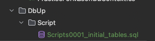
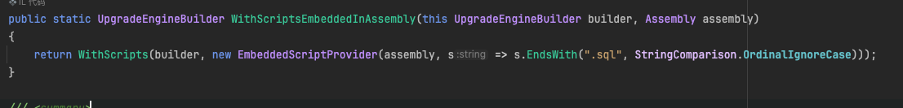
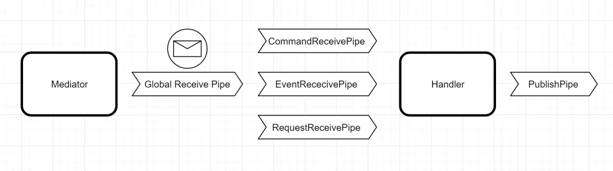

# DbUp

1. 将数据库的脚本文件放到Core项目中的DbUp文件夹中的Script文件夹中，如

   

2. 这里以.sql文件为例

   - 从程序集加载脚本

     - 新建配置类

     ```c#
         public void Run()
         {
             EnsureDatabase.For.MySqlDatabase(_connectionString);
     
             var upgradeEngine = DeployChanges.To.MySqlDatabase(_connectionString)
                 .WithScriptsEmbeddedInAssembly(typeof(DbUpRunner).Assembly) // 查找脚本
                 .WithTransaction() // 开启事务
                 .LogToAutodetectedLog() // 自动追踪日志
                 .LogToConsole()	// 日志输出到控制台
                 .Build();
     
             var result = upgradeEngine.PerformUpgrade();
             if (!result.Successful) throw new Exception("DbUp fail", result.Error);
         }
     ```

     > [!NOTE]
     >
     > 1. WithScriptsEmbeddedInAssembly方法默认查找.sql的脚本文件，源码如下
     >
     > 

     - 在项目文件中配置脚本位置

       ```xml
       <ItemGroup>
       	<EmbeddedResource Include="DbUp\**\*.sql" />
       </ItemGroup>
       ```

     - 在Program文件中启动DbUp

       ```c#
       public static void Main(string[] args)
           {
               var configuration = new ConfigurationBuilder()
                   .AddJsonFile("appsettings.json")
                   .AddEnvironmentVariables()
                   .Build();
               
               new DbUpRunner(new ConnectionString(configuration).Value).Run();
               
               // 其他代码
         			// ......
           }
       ```

   - 从文件系统加载脚本

     - 配置类

     ```c#
     public void Run(string fileScriptPath)
         {
             EnsureDatabase.For.MySqlDatabase(_connectionString);
     
             var loadScriptDirPath = Path.Combine(Path.GetDirectoryName(Assembly.GetExecutingAssembly().Location), fileScriptPath);
             var options = new FileSystemScriptOptions()
             {
                 IncludeSubDirectories = true
             };
             
             var upgradeEngine = DeployChanges.To.MySqlDatabase(_connectionString)
                 .WithScriptsFromFileSystem(loadScriptDirPath, options)
                 .WithScriptsEmbeddedInAssembly(typeof(DbUpRunner).Assembly)
                 .WithTransaction()
                 .LogToAutodetectedLog()
                 .LogToConsole()
                 .Build();
     
             var result = upgradeEngine.PerformUpgrade();
             if (!result.Successful) throw new Exception("DbUp fail", result.Error);
         }
     ```

     - Program

     ```c#
     public static void Main(string[] args)
         {
             var configuration = new ConfigurationBuilder()
                 .AddJsonFile("appsettings.json")
                 .AddEnvironmentVariables()
                 .Build();
             
             new DbUpRunner(new ConnectionString(configuration).Value).Run(nameof(Core.DbUp));
             
             // 其他代码
       			// ......
         }
     ```

     - 项目文件配置

     ```xml
     <ItemGroup>
       <Content Include="Dbup\*\*.sql">
         <CopyToPublishDirectory>PreserveNewest</CopyToPublishDirectory>
         <CopyToOutputDirectory>PreserveNewest</CopyToOutputDirectory>
       </Content>
     </ItemGroup>
     ```

   


   # Mediator.Net

   1. 工作原理：注册Handler和信息（Message）之间的绑定，因此，收到特定信息则会找出对应的Handler进行处理。

   2. 模式区别

      - 传统模式：controller层接收请求后，引入不同的类并调用方法来完成目的。大量代码在controller中紧紧耦合，controller将越来越庞大和难以控制。
      - Mediator：controller只需要引入一个Mediator，由Mediator发送信息到达目的地（Handler），在Handler中进行上下文逻辑的处理，让功能逻辑单一独立出来，使得controller只需要消息的发送。

   3. 基本工作流

      - 一个Mediator可以发送多个sendAsync
      - 一个Handler可以接受处理多个Command
      - 一个Event可以发送处理多个Command

      

   4. 优点

      - 单一职责原则。 将多个组件间的交流抽取到同一位置， 使其更易于理解和维护。
      - 开闭原则。 无需修改实际组件就能增加新的中介者。
      - 减轻应用中多个组件间的耦合情况。
      - 更方便地复用各个组件。

   5. 缺点

      - 一段时间后， 中介者可能会演化成为[上帝对象](https://refactoringguru.cn/antipatterns/god-object)。

   6. 管道

      

      - Global Receive Pipe(全局接收管道)：在消息到达下一个管道和处理程序之前，只要有消息被发送、发布或请求，此管道就会被触发
      - CommandReceivePipe(命令接收管道)：该管道将在到达命令处理程序之后和之前触发`GlobalReceivePipeline`，该管道将仅用于`ICommand`
      - EventReceivePipe(事件接收管道)：该管道将在到达其事件处理程序之后和之前触发`GlobalReceivePipeline`，该管道将仅用于`IEvent`
      - RequestReceivePipe(请求接收管道)：该管道将在到达其请求处理程序之后和之前触发`GlobalReceivePipeline`，该管道将仅用于`IRequest`
      - PublishPipe(发布管道)：当处理程序内部发布时，此管道将被触发`IEvent`，此管道仅用于`IEvent`并且通常用作传出拦截器

   7. 自定义管道：实现IPipeSpecification<>接口

      - 实现部分方法的执行时机

        - **BeforeExecute**: 在消息处理程序执行之前运行。
        - **Execute**: 在消息处理程序执行过程中运行。
        - **AfterExecute**: 在消息处理程序执行完毕后运行。
        - **OnException**: 在消息处理过程中发生异常时运行。

        

   # 异步编程

   1. 同步与异步

      - 同步：由上而下的顺序执行程序，必须等待上一步完成才会执行下一步程序。
      - 异步：当遇到特定的异步修饰符时，程序不会等待该方法完成，而是会在新线程中执行它。与该异步方法无关的代码会继续执行，而涉及异步方法操作的代码则会等待其完成后再执行。这样，代码的执行顺序是不确定的，但整体执行速度更快。

      > [!NOTE]
      >
      > 异步修饰符**async**和等待修饰符**await**：async通常用来修饰方法，且修饰的方法至少包含一个await表达式或语句，await是等待修饰符。

   2. 异步方法特点

      - 方法签名包含修饰符**async**
      - 异步方法名称通常以“**Async**”结尾
      - 返回类型通常是以下类型之一
        - Task（对于执行操作但不返回任何值的异步方法）。
        - Task\<TResult\>（对于返回值的异步方法）。
        - `void`（对于事件处理程序）。

   
