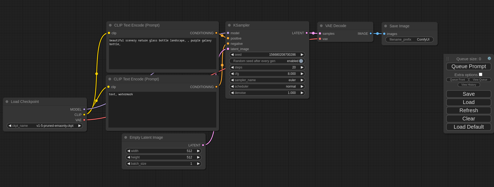

# ComfyUI



- [项目地址](https://github.com/comfyanonymous/ComfyUI)

ComfyUI允许用户通过图形化界面进行基于图形/节点/流程图的界面设计和输出执行结果。


## 安装指南（Mac）

1. **安装 Python3 和 Git，并查询版本**  
   首先需要确保你的系统上安装了 Python3 和 Git。通过 Homebrew 安装是最便捷的方法。安装完成后，可以通过以下命令查询 Python3、Pip3 和 Git 的版本，确保它们安装正确：
   
   ```bash
   brew install python3
   brew install git
   ---
   python3 --version
   pip3 --version
   git --version
   ```
   *注意：Homebrew 是 Mac 上的包管理工具，如果尚未安装，请先在终端执行 `/bin/bash -c "$(curl -fsSL https://raw.githubusercontent.com/Homebrew/install/HEAD/install.sh)"` 来安装 Homebrew。*

2. **克隆 ComfyUI 项目到本地**  
   使用 Git 将 ComfyUI 项目克隆到你的本地文件系统中，以便后续配置和使用：
   
   ```bash
   git clone https://github.com/comfyanonymous/ComfyUI
   ```

3. **创建和激活虚拟环境**  
   为了避免影响系统的全局 Python 环境，建议在项目目录中创建一个虚拟环境。虚拟环境可以隔离 Python 包的安装，使项目依赖的包版本与系统其他项目独立。以下命令将帮助你创建并激活虚拟环境：
   
   ```bash
   cd ComfyUI
   python3 -m venv venv
   ls  # 列出文件，确认 venv 文件夹是否已创建
   source venv/bin/activate  # 激活虚拟环境
   deactivate  # 当你不再使用虚拟环境时，可以使用此命令将其停用
   ```

4. **安装 Pytorch Nightly Build**  
   使用 Pytorch 的 Nightly Build 版本来获得最新的功能和修复。以下命令将从官方的 Pytorch Nightly Build 仓库安装 CPU 版本的 Pytorch 及相关包：
   
   ```bash
   pip3 install --pre torch torchvision torchaudio --extra-index-url https://download.pytorch.org/whl/nightly/cpu
   ```
   *注意：如果你的系统支持 GPU 加速，你可能需要安装相应的 CUDA 版本。*

5. **下载模型**  
   ComfyUI 依赖于各种预训练模型。你可以通过访问提供的链接来下载所需的模型，并将其放置在 `models/checkpoints` 目录下：
   - 模型下载链接（仅供参考，不唯一）：[Ten Models Worth Downloading](https://www.comflowy.com/zh-CN/blog/ten-models-worth-downloading)

6. **安装 ComfyUI Manager**  
   ComfyUI Manager 是一个用于管理自定义节点的工具。你可以通过以下命令将其克隆到 `custom_nodes` 目录中：
   
   ```bash
   cd custom_nodes
   git clone https://github.com/ltdrdata/ComfyUI-Manager
   ```

7. **安装 Python 依赖包**  
   在项目的根目录下运行以下命令来安装 ComfyUI 所需的所有依赖包：
   
   ```bash
   cd ..
   pip install -r requirements.txt
   ```

8. **加载模型并启动 ComfyUI**  
   最后，确保模型文件已放置在正确的目录下，然后使用以下命令启动 ComfyUI：
   
   ```bash
   cd models/checkpoints  # 切换到模型存放目录
   ls # 查看模型文件是否已存放进去
   
   python main.py --force-fp16  # 在ComfyUI项目路径启动 ComfyUI 并强制使用 FP16 精度
   ```

**补充说明：**
- 如果在执行上述步骤时遇到任何问题，请检查错误信息，并根据提示进行调整。
- 在首次运行 ComfyUI 时，可能会花费一些时间来加载模型和依赖包。

⚠️ 如果一直启动不成功，可以下载pycharm打开项目，因为pycharm会图形化下载依赖会更方便，然后main.py启动即可。


## 运行

在项目根目录下运行 `python main.py` 命令，访问 http://127.0.0.1:8188/ 即可体验`ComfyUI`。

配置好节点，调整参数后，点击 `Queue Prompt` 等待一段时间后生成图片。

