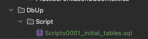
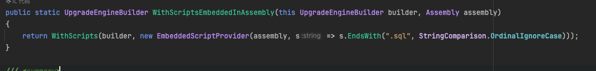

# DbUp

1. 将数据库的脚本文件放到Core项目中的DbUp文件夹中的Script文件夹中，如

   

2. 这里以.sql文件为例

   - 从程序集加载脚本

     - 新建配置类

     ```c#
         public void Run()
         {
             EnsureDatabase.For.MySqlDatabase(_connectionString);
     
             var upgradeEngine = DeployChanges.To.MySqlDatabase(_connectionString)
                 .WithScriptsEmbeddedInAssembly(typeof(DbUpRunner).Assembly) // 查找脚本
                 .WithTransaction() // 开启事务
                 .LogToAutodetectedLog() // 自动追踪日志
                 .LogToConsole()	// 日志输出到控制台
                 .Build();
     
             var result = upgradeEngine.PerformUpgrade();
             if (!result.Successful) throw new Exception("DbUp fail", result.Error);
         }
     ```

     > [!NOTE]
     >
     > 1. WithScriptsEmbeddedInAssembly方法默认查找.sql的脚本文件，源码如下
     >
     > 

     - 在项目文件中配置脚本位置

       ```xml
       <ItemGroup>
       	<EmbeddedResource Include="DbUp\**\*.sql" />
       </ItemGroup>
       ```

     - 在Program文件中启动DbUp

       ```c#
       public static void Main(string[] args)
           {
               var configuration = new ConfigurationBuilder()
                   .AddJsonFile("appsettings.json")
                   .AddEnvironmentVariables()
                   .Build();
               
               new DbUpRunner(new ConnectionString(configuration).Value).Run();
               
               // 其他代码
         			// ......
           }
       ```

   - 从文件系统加载脚本

     - 配置类

     ```c#
     public void Run(string fileScriptPath)
         {
             EnsureDatabase.For.MySqlDatabase(_connectionString);
     
             var loadScriptDirPath = Path.Combine(Path.GetDirectoryName(Assembly.GetExecutingAssembly().Location), fileScriptPath);
             var options = new FileSystemScriptOptions()
             {
                 IncludeSubDirectories = true
             };
             
             var upgradeEngine = DeployChanges.To.MySqlDatabase(_connectionString)
                 .WithScriptsFromFileSystem(loadScriptDirPath, options)
                 .WithScriptsEmbeddedInAssembly(typeof(DbUpRunner).Assembly)
                 .WithTransaction()
                 .LogToAutodetectedLog()
                 .LogToConsole()
                 .Build();
     
             var result = upgradeEngine.PerformUpgrade();
             if (!result.Successful) throw new Exception("DbUp fail", result.Error);
         }
     ```

     - Program

     ```c#
     public static void Main(string[] args)
         {
             var configuration = new ConfigurationBuilder()
                 .AddJsonFile("appsettings.json")
                 .AddEnvironmentVariables()
                 .Build();
             
             new DbUpRunner(new ConnectionString(configuration).Value).Run(nameof(Core.DbUp));
             
             // 其他代码
       			// ......
         }
     ```

     - 项目文件配置

     ```xml
     <ItemGroup>
       <Content Include="Dbup\*\*.sql">
         <CopyToPublishDirectory>PreserveNewest</CopyToPublishDirectory>
         <CopyToOutputDirectory>PreserveNewest</CopyToOutputDirectory>
       </Content>
     </ItemGroup>
     ```

   

## 问题

原先的配置是扫描整个程序集，这样配置过于庞大，而且只能使用`.sql`文件。如果以后需要使用`.cs`作为脚本文件，就无法实现。


## 解决方案

1. **将扫描的程序集由外部传入**：原本是在内部定义扫描的程序集，现在改为通过外部传入。

2. **自定义扫描配置**：通过查看源码发现，默认只扫描`.sql`文件的原因是方法默认配置的限制，但也提供了重载方法以自定义扫描配置。将自定义扫描配置同样由外部传入，这样就不再仅限于扫描`.sql`文件。

3. **设置默认值**：为外部传入的程序集和自定义扫描配置规则参数设置默认值。默认情况下，扫描所有程序集并使用`.sql`文件。

   

## 代码

```c#
public void Run(Assembly? assembly = null, Func<string, bool>? func = null)
{
    EnsureDatabase.For.MySqlDatabase(_connectionString);

    var upgradeEngine = CreateUpgradeEngine(assembly, func);

    var result = upgradeEngine.PerformUpgrade();
    if (!result.Successful) throw new Exception("DbUp fail", result.Error);
}

private UpgradeEngine CreateUpgradeEngine(Assembly? assembly, Func<string, bool>? filter)
{
    assembly ??= Assembly.GetExecutingAssembly();
    filter ??= s => s.EndsWith(".sql");

    var upgradeEngineBuilder = DeployChanges.To.MySqlDatabase(_connectionString)
        .WithScriptsEmbeddedInAssembly(assembly, filter)
        .WithTransaction()
        .LogToConsole();


    return upgradeEngineBuilder.Build();
}
```

