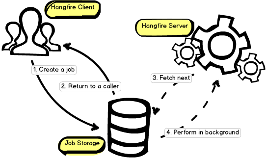

# Hangfire

## 概述

- Hangfire允许以一种简单可靠的方式在请求处理管道之外启动方法调用。这些方法调用在后台线程中执行，称为后台作业。

- 大致来看，该库由三个主要组件组成：客户端（Hangfire Client）、存储（Job Storage）和服务器（Hangfire Server）组成。主要流程如下图：

  

### Client

- Hangfire 支持创建各种类型的后台作业，包括：

  - **一次性作业**（Fire-and-forget）：用于立即执行的方法调用。
  - **延迟作业**（Delayed）：用于在指定时间后执行的方法调用。
  - **周期性作业**（Recurring）：用于按设定的时间间隔重复执行的方法调用。

- 使用 Hangfire 不需要创建特殊的类。后台作业基于常规的静态或实例方法调用即可。

  ```c#
  var client = new BackgroundJobClient();
  
  client.Enqueue(() => Console.WriteLine("Easy!"));
  client.Delay(() => Console.WriteLine("Reliable!"), TimeSpan.FromDays(1));
  ```

  

- 另外，可以使用 `BackgroundJob` 类中的静态方法来更简便地创建任务。

  ```c#
  BackgroundJob.Enqueue(() => Console.WriteLine("Hello!"));
  ```

- 客户端的主要职责是创建任务。它将任务信息（不是委托，而是表达式树）进行序列化，然后存储在指定的存储中（如 Redis、SQL Server 等）。

### Storage

Hangfire 将后台作业和其他与持久存储中的处理相关的信息保存起来。持久性有助于后台作业在应用程序重新启动、服务器重新启动等情况下继续存在。这是使用 CLR 的线程池和 Hangfire 执行后台作业之间的主要区别。支持不同的存储后端：

- SQL Azure, SQL Server, MySQL等
- Redis

```
GlobalConfiguration.Configuration.UseSqlServerStorage("db_connection");
```

### Server

- 后台作业由 Hangfire Server 处理。它是作为一组专用（不是线程池的）后台线程实现的，这些线程从存储中获取作业并处理它们。服务器还负责保持存储清洁并自动删除旧数据。

- Hangfire 对每个存储后端使用可靠的获取算法，因此可以在 Web 应用程序内开始处理，而不会面临在应用程序重新启动、进程终止等情况下丢失后台作业的风险。


## Enqueue

```c#
BackgroundJob.Enqueue(() => Console.WriteLine("Hello, world!"));
```

`Enqueue`方法不会立即调用目标方法，而是运行以下步骤：

1. 序列化方法信息及其所有参数
2. 根据序列号信息创建新的后台作业
3. 将后台作业保存到Storage中
4. 将后台作业排队到其队列中

执行这些步骤后， `BackgroundJob.Enqueue` 方法立即返回给调用者。Hangfire Server检查持久存储中是否有排队的后台作业并以可靠的方式执行它们。

排队作业由专门的工作线程池处理，每个worker都会调用以下流程：

1. 获取下一份作业并对其他woker隐藏
2. 执行作业及其所有扩展过滤器
3. 从队列中删除作业

⚠️ 只有成功处理作业后，作业才会被删除。即使在执行过程某个进程被终止，Hangfire也会执行补偿逻辑来保证每个作业的处理。


### Schedule

```c#
BackgroundJob.Schedule(
    () => Console.WriteLine("Hello, world"),
    TimeSpan.FromDays(1));
```

Hangfire Server 定期检查计划，将计划的作业排入其队列，从而允许工作人员执行它们。默认情况下，检查间隔为 `15 s` ，但可以通过在传递给 `BackgroundJobServer` 构造函数的选项上设置 SchedulePollingInterval 属性来更改它：

```c#
var options = new BackgroundJobServerOptions
{
    SchedulePollingInterval = TimeSpan.FromMinutes(1)
};

var server = new BackgroundJobServer(options);
```

⚠️ 执行延迟作业需要注意以下事项：

- 禁用空闲超时 – 将其值设置为 `0` 。
- 使用应用程序自动启动功能。


### Recurrent

```c#
RecurringJob.AddOrUpdate("easyjob", () => Console.Write("Easy!"), Cron.Daily);
```

该行在Storage中创建一个新作业。 Hangfire Server 中的一个特殊组件将会以分钟为基础检查重复作业，然后将它们作为“一次性”作业排入队列。这使能够像往常一样跟踪它们。

该方法的第一个参数为标识符，每个重复作业必须使用唯一标识符，否则该作业将以单次作业结束。另外，在某些Storage中，标识符可能区分大小写。

该方法的第二个参数为Cron表达式。该作业将遵循Cron表达式去运行作业。Cron类包含不同方法和重载，可以按分钟、每小时、每天、每周、每月和每年运行作业，也可以制定更复杂的规则去执行计划。

- 删除现有重复作业可以使用`RemoveIfExists`方法。当没有此类重复作业时，不会引发异常。

  ```c#
  RecurringJob.RemoveIfExists("some-id");
  ```

- 如果要立即运行重复作业，可以使用`Trigger`方法。周期性作业本身不会记录触发调用信息，也不会从本次运行中重新计算下次执行时间。例如，如果您有一项在周三运行的每周作业，并且您在周五手动触发它，它将在下周三运行。

  ```c#
  var manager = new RecurringJobManager();
  manager.AddOrUpdate("some-id", Job.FromExpression(() => Method()), Cron.Yearly());
  ```

  

## 使用Redis

### 为什么使用Redis作为Storage

- 使用 Redis 作业存储实现的 Hangfire 处理作业的速度比使用 SQL Server 存储快得多。空作业（不执行任何操作的方法）的吞吐量提高了 4 倍以上。 `Hangfire.Pro.Redis` 利用 `BRPOPLPUSH` 命令来获取作业，因此作业处理延迟保持在最低限度。

### 配置

- 在Startup文件中的ConfigureServices按如下代码配置，即可使用Redis进行Hangfire

⚠️ 如果连接字符串为空，将使用默认端口、数据库和选项连接到本地主机上的 Redis。

```c#
public void ConfigureServices(IServiceCollection services)
    {
        ...
          
        // 配置 Hangfire 使用 Redis
        services.AddHangfire(config => config.UseRedisStorage("连接字符串"));

        // 添加 Hangfire 服务器
        services.AddHangfireServer();
    }
```


## 传递依赖关系

在后台调用静态方法时，限于应用程序的静态上下文，需要使用以下获取依赖项的模式：

- 手动实例化依赖项（通过 `new` 运算符）
- 服务定位器模式
- 抽象工厂或建造者模式
- 单例模式

这些模式会使单元测试变得复杂。为了解决这个问题，Hangfire 允许在后台调用实例方法。例如：

```c#
public class EmailSender
{
    private IDbContext _dbContext;
    private IEmailService _emailService;

    public EmailSender() : this(new DbContext(), new EmailService()) { }

    internal EmailSender(IDbContext dbContext, IEmailService emailService)
    {
        _dbContext = dbContext;
        _emailService = emailService;
    }

    public void Send(int userId, string message)
    {
        // 处理逻辑
    }
}
```

在后台调用 `Send` 方法：

```c#
BackgroundJob.Enqueue<EmailSender>(x => x.Send(13, "Hello!"));
```

当工作线程需要调用实例方法时，会使用 `JobActivator` 类创建该类的实例，默认使用 `Activator.CreateInstance` 方法，这要求类有默认构造函数。如果类需要进行单元测试，可以添加构造函数重载。如果使用 IoC 容器（如 Autofac、Ninject、SimpleInjector 等），可以去掉默认构造函数。


### 使用Cancellation Tokens

- Hangfire 支持后台作业的取消令牌，以在关闭请求或作业中止时通知它们，从 Hangfire 1.7.0 开始，可以使用常规的 `CancellationToken` 类，它是完全异步的且安全。后台进程会监视包含取消令牌参数的作业，并在状态变化或请求关闭时取消相应令牌。轮询延迟可通过`BackgroundJobServerOptions.CancellationCheckInterval` 配置。


## 异常处理

1. **异常类型**：

   - 方法可以抛出不同类型的异常：
     - 需要重新部署应用程序的编程错误。
     - 无需额外部署即可修复的瞬态错误。

2. **异常处理机制**：

   - Hangfire 处理所有内部（属于 Hangfire 本身）和外部方法（作业、过滤器等）中的异常。
   - 异常不会导致整个应用程序崩溃。
   - 所有内部异常都会被记录（需启用日志记录）。
   - 在 10 次重试尝试后，后台处理将停止。

3. **外部异常处理**：

   - Hangfire 在作业执行过程中遇到外部异常时，会将作业状态更改为 Failed。
   - 在 Monitor UI 中可以找到这些失败的作业，除非明确删除，否则不会过期。

4. **状态转换和重试机制**：

   - Hangfire 尝试将作业状态更改为失败时，作业过滤器可以拦截并更改初始管道。
   - `AutomaticRetryAttribute` 类会安排失败的作业在增加延迟后自动重试。
   - 默认情况下，所有方法有 10 次重试尝试，出现异常时会自动重试，并在每次失败时记录警告日志消息。
   - 如果重试尝试次数超出最大限制，作业将转至 Failed 状态，并记录错误日志消息，可手动重试。

5. **自定义重试尝试**：

   - 如果不希望重试作业，可使用 `AutomaticRetry` 属性设置最大重试尝试次数为 0：

     ```csharp
     [AutomaticRetry(Attempts = 0)]
     public void BackgroundMethod()
     {
     }
     ```

   - 使用相同方式限制不同的重试次数：

     ```csharp
     GlobalJobFilters.Filters.Add(new AutomaticRetryAttribute { Attempts = 5 });
     ```

6. **在 ASP.NET Core 中使用**：

   - 使用 `IServiceCollection` 扩展方法 `AddHangfire`：

     ```csharp
     services.AddHangfire((provider, configuration) =>
     {
         configuration.UseFilter(provider.GetRequiredService<AutomaticRetryAttribute>());
     });
     ```

   - 注意 `AddHangfire` 使用 `GlobalJobFilter` 实例，因此依赖项应为 Transient 或 Singleton。


# 配置线程池

1. **工作线程池**：

   - 后台作业由 Hangfire Server 子系统内的专用工作线程池处理。
   - 启动后台作业服务器时，会初始化线程池并启动固定数量的工作线程（默认20）。
   - 可以通过 `UseHangfireServer` 方法指定工作线程数量。

2. **示例代码**：

   ```csharp
   var options = new BackgroundJobServerOptions { WorkerCount = Environment.ProcessorCount * 5 };
   app.UseHangfireServer(options);
   ```

3. **在 Windows 服务或控制台应用程序中使用**：

   - 如果在 Windows 服务或控制台应用程序中使用 Hangfire，执行以下操作：

     ```csharp
     var options = new BackgroundJobServerOptions
     {
         // 默认值
         WorkerCount = Environment.ProcessorCount * 5
     };
     
     var server = new BackgroundJobServer(options);
     ```

4. **手动配置并行度**：

   - 工作池使用专用线程与请求分开处理作业。

   - 可以处理 CPU 密集型或 I/O 密集型任务。

   - 手动配置并行度，以优化资源使用和任务处理效率。

     

## 运行多个服务器实例（仅供了解）

**问题**：在运行多个服务器实例的情况下，测试周期性作业时，作业是否会被多次执行？

**回答**：不会。根据 [Running Multiple Server Instances](https://docs.hangfire.io/en/latest/background-processing/running-multiple-server-instances.html) 的说明，在一个进程、机器内或多台机器上同时运行多个服务器实例时，Hangfire 使用分布式锁来协调作业执行。

每个 Hangfire 服务器都有一个唯一的标识符，该标识符由两部分组成：

1. **服务器名称**：默认为机器名称，用于处理不同机器上的唯一性。
2. **进程 ID**：处理同一台机器上的多个服务器实例。

例如，服务器标识符可能是 `server1:9853`、`server1:4531`、`server2:6742`。由于默认值仅在进程级别提供唯一性，如果需要在同一进程内运行不同的服务器实例，应手动设置唯一的服务器名称：

```csharp
services.AddHangfireServer(options =>
{
    options.ServerName = String.Format(
        "{0}.{1}",
        Environment.MachineName,
        Guid.NewGuid().ToString());
});
```

从 Hangfire 1.5 开始，服务器标识符现在使用 GUID 生成，因此所有实例名称都是唯一的，不再需要额外配置来支持同一进程中的多个后台处理服务器。


## 集成到项目

### 配置服务

```c#
public class Startup
{
    public Startup(IConfiguration configuration)
    {
        Configuration = configuration;
    }

    public IConfiguration Configuration { get; }

    public void ConfigureServices(IServiceCollection services)
    {
        // ......
      
      	// 配置Redis作为Storage
        services.AddHangfire(configuration => configuration.UseRedisStorage(Configuration["RedisCacheConnectionString"]));
        services.AddHangfireServer();
    }
  
  // ......
  
  public void Configure(IApplicationBuilder app, IWebHostEnvironment env)
    {
        // ......

    		// 开启UI罗表盘
        app.UseHangfireDashboard();
    		// ......
    }
}
```


### 周期性任务

```c#
// demo
RecurringJob.AddOrUpdate("easyjob", () => Console.Write("Easy!"), Cron.Daily);
```

```c#
// AddOrUpdate源码
public static void AddOrUpdate(
            [NotNull] string recurringJobId,
            [NotNull, InstantHandle] Expression<Func<Task>> methodCall,
            [NotNull] string cronExpression,
            [NotNull] RecurringJobOptions options)
        {
            var job = Job.FromExpression(methodCall);
            Instance.Value.AddOrUpdate(recurringJobId, job, cronExpression, options);
        }
```

AddOrUpdate接收五个参数：

`recurringJobId`: 任务的唯一ID，用于标识周期性任务。

`methodCall`: 一个表达式，指定要调用的方法。

`cronExpression`: 一个返回Cron表达式的函数，用于定义任务的执行计划。

`option`: 可选参数，配置。

- 封装接口

  ```c#
  public interface IRecurringJob
  {
      Task Execute();
      
      string JobId { get; }
      
      string CronExpression { get; }
  }
  ```

- Demo(HelloWorldScheduleJob)

  ```c#
  public class HelloWorldScheduleJob : IRecurringJob
  {
      public Task Execute()
      {
          Console.WriteLine("Hello World " + DateTime.Now.ToString("yyyy-MM-dd HH:mm:ss"));
          return Task.CompletedTask;
      }
  
      public string JobId => nameof(HelloWorldScheduleJob);
      public string CronExpression => "0 * * * * ?";
  }
  ```

- 在Autofac注册Job

  ```c#
  private void RegisterJobs(ContainerBuilder builder)
      {
          foreach (var type in typeof(IRecurringJob).Assembly.GetTypes()
                       .Where(t => typeof(IRecurringJob).IsAssignableFrom(t) && t.IsClass))
          {
              builder.RegisterType(type).AsSelf().AsImplementedInterfaces().InstancePerLifetimeScope();
          }
      }
  ```

  

- 在Startup配置自动运行

  ```c#
  // Startup配置    
  public void Configure(IApplicationBuilder app, IWebHostEnvironment env)
      {
         	// ......
    
          app.AddRecurringJobs();
      }
  
  public static class HangfireExtension
  {
      public static void AddRecurringJobs(this IApplicationBuilder app)
      {
          foreach (var type in typeof(IRecurringJob).Assembly.GetTypes()
                       .Where(type => type.IsClass && typeof(IRecurringJob).IsAssignableFrom(type)))
          {
              var job = (IRecurringJob) app.ApplicationServices.GetRequiredService(type);
              
              if (typeof(IRecurringJob).IsAssignableFrom(type))
              {
                  RecurringJob.AddOrUpdate(job.JobId, () => job.Execute(), job.CronExpression);
              }
          }
      }
  }
  ```

  

周期性方法类实现`IRecurringJob`接口, 通过依赖注入IMediator、IService等，在Execute方法实现方法体即可。

```c#
public class ProductCountJob : IRecurringJob
{
    private readonly IMediator _mediator;

    public ProductCountJob(IMediator mediator)
    {
        _mediator = mediator;
    }

    public async Task Execute()
    {
        var response = await _mediator.RequestAsync<GetAllProductsRequest, GetAllProductsResponse>(new GetAllProductsRequest()).ConfigureAwait(false);

        Console.WriteLine(response.Result.Count == 0
            ? "No products found"
            : $"Total products count: {response.Result.Count}");
    }

    public string JobId => nameof(ProductCountJob);
    public string CronExpression => "0 0 1 * * *";
}
```

