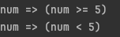

# Lambda

## 一、匿名方法与Lambda

1. 匿名方法

   - 匿名方法: 没有名字的方法，但仍有方法体。

   ```c#
   // Demo
   // 创建委托Del
   public deletgate void Del(int x);
   
   static void Main()
   {
     // 使用匿名方法创建委托对象
     Del d = delegate(int x){
       Console.WriteLine(x);
     }
   }
   ```

   > [!NOTE]
   >
   > 通过使用匿名方法，由于不必创建单独的方法，因此减少了实例化委托所需的编码系统开销。

   > [!IMPORTANT]
   >
   > 补充：委托（Delegate）
   >
   > - 声明与实例化
   >
   > ```c#
   > delegate <return type> <delegate-name> <parameter list>; // 模板
   > ```
   >
   > ```c#
   > // demo
   > delegate int Calculate(int Num);
   > static int n = 10;
   > static int AddNum(int Num){
   >   n += Num;
   >   return n;
   > }
   > static int MultNum(int Num){
   >   n *= Num;
   >   return n;
   > }
   > 
   > Calculate ps1 = new Calculate(AddNum);
   > ps1(10);
   > // 输出 20
   > Calculate ps2 = new Calculate(MultNum);
   > ps2(10);
   > // 输出 200
   > ```
   >
   > 在实例化时，printString中传递的是不带参数的方法名即可。
   >
   > 委托对象的引用方法必须满足：1. 方法返回类型与委托声明返回类型一致；2. 方法参数列表必须和委托声明参数列表一致。
   >
   > - 委托的多播
   >
   >   委托对象可以用“+”或“-”运算符合并或移除委托
   >
   > ```c#
   > // 上述两个委托即可使用“+”运算符合并
   > Calculate ps = ps1 + ps2;
   > ps(10);
   > // 输出200
   > ```

   

2. Lambda

   - Lambda表达式：一种可用于创建委托或表达式目录树类型的匿名函数。

     创建格式：左侧制定输入参数（如果有） => 表达式或语句块

     ```c#
     public deletgate void Del(int x);
     
     static void Main(string[] args)
     {
       // 委托
       Del del = x => Console.WriteLine(x * x);
       del(2);//4
       
       // 表达树
       System.Linq.Expressions.Expression<Del> expression = x => Console.WriteLine(x);
       Console.Read();
     }
     ```

   - 标准运算符: 组成语言集成查询 (LINQ) 模式的方法。 大多数这些方法都在序列上运行，其中的序列是一个对象，其类型实现了 IEnumerable\<T\> 接口或 IQueryable\<T\> 接口。 标准查询运算符提供了包括筛选、投影、聚合、排序等功能在内的查询功能。

     ```c#
     // 多数运算符都有输入参数，其类型是17个.net泛型委托Func<T,TResult>中的一种。
     
     // 如，Count方法扩展自IEnumerable<TSource>，并且有输入参数Func<TSource, bool> predicate。
     public static int Count<TSource>(this IEnumerable<TSource> source, Func<TSource, bool> predicate);
     ```

   - 类型推断: Lambda表达式通常不必为输入参数指定类型，因为编译器可以根据 lambda 主体、参数的委托类型以及 C# 语言规范中描述的其他因素来推断类型。 对于大多数标准查询运算符，第一个输入是源序列中的元素类型。 因此，如果要查询 IEnumerable\<Customer\>，则输入变量将被推断为 Customer 对象，这意味着你可以访问其方法和属性：

     ```c#
     customers.Where(c => c.City == "London");
     ```

     > [!CAUTION]
     >
     > Lambda的一般规则：
     >
     > Lambda 包含的参数数量必须与委托类型包含的参数数量相同。
     >
     > ```c#
     > // 正确例子
     > Func<int,int,int> add = (a,b) => a+b;
     > 
     > // 错误例子
     > Func<int,int,int> add = a => a;
     > // Lambda表达式的输入参数仅只有一个时才可以省略括号
     > ```
     >
     > 
     >
     > Lambda 中的每个输入参数必须都能够隐式转换为其对应的委托参数。
     >
     > ```c#
     > // 正确的例子（int 可以隐式转换为 double）
     > Func<double, double, double> addDoubles = (a, b) => a + b;
     > 
     > // 错误的例子（string 不能隐式转换为 int）
     > Func<int, int, int> invalid = (a, b) => a.ToString(); 
     > ```
     >
     > 
     >
     > Lambda 的返回值（如果有）必须能够隐式转换为委托的返回类型。
     >
     > ```c#
     > // 正确的例子（int 可以隐式转换为 double）
     > Func<int, int, double> addAndConvert = (a, b) => a + b;
     > 
     > // 错误的例子（string 不能隐式转换为 int）
     > Func<int, int, int> invalid = (a, b) => a.ToString();
     > ```

## 二、Expression

1. 表达树：表达式树以树形数据结构表示代码，其中每一个节点都是一种表达式，比如方法调用和 x < y 这样的二元运算等。

2. 创建方式：以**Lambda表达式**创建，通过**API静态方法**创建。

   - Lambda表达式创建

     ```c#
     System.Linq.Expressions.Expression<Func<int, bool>> lambda = num => num >= 5;
     ```

   - API静态方法创建

     ```c#
     // 通过API静态方法创建需要使用Expression类的一系列静态方法。
     // 首先引入命名空间
     using System.Linq.Expressions;
     
     //创建表达式 num=>num>=5
     //第一步创建输入参数,参数名为num，类型为int类型
     ParameterExpression numParameter = Expression.Parameter(typeof(int), "num");
     //第二步创建常量表达式5，类型int
     ConstantExpression constant = Expression.Constant(5, typeof(int));
     //第三步创建比较运算符>=,大于等于,并将输入参数表达式和常量表达式输入
     //表示包含二元运算符的表达式。BinaryExpression继承自Expression
     BinaryExpression greaterThanOrEqual = Expression.GreaterThanOrEqual(numParameter, constant);
     //第四步构建lambda表达式树
     //Expression.Lambda<Func<int, bool>>:通过先构造一个委托类型来创建一个 LambdaExpression
     Expression<Func<int, bool>> lambda = Expression.Lambda<Func<int, bool>>(greaterThanOrEqual, numParameter);
     ```

     使用方法说明：

     - Parameter：命名参数, 如代码中，命名一个int类型、名称为num的实参，相当于 int num；
     - Constant：定义了一个int类型、值为5的常量；
     - GreaterThanOrEqual：表示">="。

3. 表达式树解析

   以如下表达式树举例：

   ```c#
   Expression<Func<int, bool>> expTree = num => num >= 5;
   ```

   接下来解析各部分:

   ```c#
   Expression<Func<int,bool>> expTree = num => num >= 5;
   // 获取输入参数
   ParameterExpression parameter = expTree.Parameters[0];
   // 获取Lambda表达式主题部分
   BinaryExpression body = (BinaryExpression)expTree.Body;
   // 获取num>=5左半部分
   ConstantExpression left = (ConstantExpression)body.Left;
   // 获取num>=5右半部分
   ConstantExpression right = (ConstantExpression)body.Right;
   // 获取比较运算符
   ExpressionType type = body.NodeType;
   ```

4. 表达式树特性

   表达式树应具有永久性。如果想修改表达式树，则需要复制该表达式树然后替换其中节点来创建一个新的表达式树。

   可以通过ExpressionVisitor类遍历现有表达式树，并复制其每个访问节点

   ```c#
   public static void Main(string[] args)
   {
     // 这里以num => num >= 5为例，将>=修改为<
     Expression<Func<int,bool>> expTree = num => num >= 5;
     // 修改前
     Console.WriteLine(expTree);
     LessThanModifier modifier = new LessThanModifier();
     Expression modifiedExpr = modifier.Modify(expTree);
     // 修改后
     Console.WriteLine(modifiedExpr);
   }
   
   
   class LessThanModifier : ExpressionVisitor
   {
       public Expression Modify(Expression expression)
       {
           return Visit(expression);
       }
       
       protected override Expression VisitBinary(BinaryExpression node)
       {
           if (node.NodeType == ExpressionType.GreaterThanOrEqual)
           {
               Expression left = this.Visit(node.Left);
               Expression right = this.Visit(node.Right);
   
               return Expression.MakeBinary(ExpressionType.LessThan, left, right, node.IsLiftedToNull, node.Method);
           }
   
           return base.VisitBinary(node);
       }
   }
   ```

   输出结果

   

5. 编译表达式树

   - Expression\<TDelegate\> 类型提供了 Compile 方法以将表达式树表示的代码编译成可执行委托。

```c#
//创建表达式树
Expression<Func<int, bool>> expTree = num => num >= 5;
// Compile方法将表达式树描述的 lambda 表达式编译为可执行代码，并生成表示该 lambda 表达式的委托。
Func<int, bool> func = expTree.Compile();
// 结果
bool result = func(10);//true
Console.WriteLine(result);
```


# 学习yesmeal

## 解析`GenerateInterfaceQueryFilter`

1. Expression.Paramter方法构建传入参数

2. 调用`GenerateInterfaceQueryFilterBodyExpressions`方法构建逻辑表达式

3. 调用`Aggregate`将多个表达式构建成一个 综合性的表达式

   假设 `bodyExpressions` 中包含以下三个表达式：

   - `x => x.IsDel == false`
   - `x => x.IsActive == true`
   - `x => x.IsPremiumMemberOnly == false`

   `Aggregate(Expression.AndAlso)` 将它们组合成一个综合表达式：

   ```c#
   x => (x.IsDel == false) && (x.IsActive == true) && (x.IsPremiumMemberOnly == false)
   ```

## 解析`GenerateInterfaceQueryFilterBodyExpressions`

1. **构建传入参数表达式**：首先会根据传入的类型参数，判断该类型是否实现了特定的接口（例如是否可软删除、是否可激活等）。如果实现了某个接口，就会生成相应的逻辑表达式，用于筛选符合条件的数据。
2. **逻辑表达式生成**：对于每个满足条件的接口，生成相应的表达式。这些表达式可能包括等值判断（如某个布尔属性是否为真或假），也可能涉及日期比较等更复杂的逻辑。生成的表达式通过 `yield return` 依次返回，最终形成一个逻辑表达式的集合。
3. **日期相关逻辑处理**：当类型实现了日期范围过滤接口时，方法会生成与当前日期比较的表达式。生成的日期比较逻辑依赖于特定的日期字段及过滤类型（例如大于、等于、小于等比较操作）。
