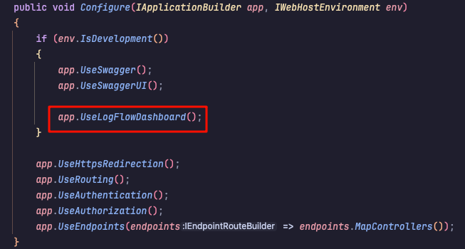

# LogFlow

## 后端

1. 将前端项目打包资源内嵌进项目。
   - 使用 `EmbeddedFileProvider` 将打包好的前端资源嵌入到程序集内，以便后端能够直接访问这些资源，而无需依赖外部文件系统。
   - 嵌入的文件路径由常量 `EmbeddedFileNamespace = "LogFlow.Dashboard.Pages.dist"` 指定。

2. 判断请求路径和方法，根据是否请求静态文件执行相应操作，最终处理非静态文件时返回 `index.html`。
   - 通过 `Invoke(HttpContext)` 方法，根据请求的 `HTTP` 方法和路径，决定如何处理请求。
   - 如果请求路径为 `/LogFlow` 且带有文件扩展名，则调用 `StaticFileMiddleware` 处理嵌入式静态文件请求。
   - 如果请求路径没有文件扩展名（非静态文件请求），则返回嵌入式的 `index.html` 页面，并根据 `AspNetCoreDashboardOptions` 配置替换其中的动态占位符（如文档标题、头部内容等）。
   
3. 使用 `AspNetCoreDashboardOptions` 进行动态内容替换（目前仅支持四种类型，具体插入位置需要前端打包文件提供相对应的占位来替换）：
   - `DocumentTitle`：网页的标题。
   - `HeadContent`：注入到 `<head>` 中的额外内容。
   - `StylesPath`：前端样式文件路径。
   - `ScriptBundlePath`：前端脚本捆绑包的路径。

4. 编写 `CustomStaticFileAccessor` 类提供内嵌资源的访问：
   - **构造函数**：通过依赖注入方式传入了`RequestDelegate`、程序集(`Assembly`)、嵌入资源文件的命名空间、请求路径、是否使用白名单以及黑白名单用来过滤的文件扩展名集合来初始化类。通过这些参数，类可以确定哪些请求路径需要处理，哪些文件类型被允许访问。
   
   - **请求路径匹配**：在`InvokeAsync`方法中，当接收到请求时，首先检查请求的路径是否以指定的`RequestPath`开头，确保只处理相关路径下的请求。将请求路径转换为相应的嵌入资源路径。
   
   - **文件访问权限检查**：通过`IsFileAccessAllowed`方法，根据传入的文件扩展名集合（白名单或黑名单）来判断是否允许访问特定文件。支持文件扩展名的过滤逻辑，允许通过白名单或黑名单方式控制文件访问。
   
   - **获取嵌入资源**：如果路径有效且符合文件访问权限，通过程序集(`Assembly`)的`GetManifestResourceStream()`方法读取嵌入资源文件的流。
   
   - **设置响应**：
   
     - 确定文件的内容类型（`Content-Type`），根据文件扩展名推断其MIME类型。
     - 根据文件类型设置`Content-Disposition`，决定文件是内联显示还是作为附件下载。
     - 将文件流的内容复制到HTTP响应的主体中，并设置响应的长度和状态。
   
   - **默认处理**：如果请求路径不匹配或文件不存在，则传递给下一个中间件处理（通过`_next(context)`实现）。
   
     

## 前端

1. 路由需以“/LogFlow”为前缀。
2. 设置vite.config.ts文件的base属性为“/LogFlow”。

## 使用

1. 在Startup的Configure方法中，编写`app.UseLogFlowDashboard();`

   

2. 启动Web项目，在`http://localhost:[端口号]/logflow（logflow不区分大小写）`访问Dashboard页面