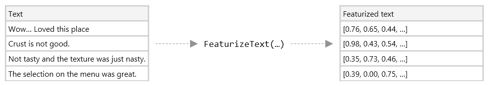

# ML.NET

## 什么是ML.NET

- ML.NET 是适用于 .NET 开发人员平台的免费开放源代码和跨平台机器学习框架。

- ML.NET 允许你对各种 ML 方案使用 C# 或 F# 来训练、构建和发布定制的机器学习模型。ML.NET 包括自动机器学习 (AutoML) 等功能以及 [ML.NET CLI](https://learn.microsoft.com/dotnet/machine-learning/automate-training-with-cli?WT.mc_id=dotnet-35129-website) 和 [ML.NET Model Builder](https://dotnet.microsoft.com/apps/machinelearning-ai/ml-dotnet/model-builder) 等工具，这使得将机器学习集成到应用中变得更加容易。


## 使用流程

### 创建ML.NET上下文

MLContext 是所有 ML.NET 操作的起点。`MLContext` 用于创建和使用 ML.NET 模型的所有方面。它在概念上类似于实体框架中的 `DbContext`。

```csharp
var mlContext = new MLContext();
```

一旦有了 `MLContext` 实例，就可以加载和转换数据、为机器学习任务选择最佳算法、训练模型。训练完成后，可以测试模型的准确性，将其保存到磁盘，并使用它进行预测。可以从以前保存到磁盘的模型初始化 `MLContext`。

### 加载数据

MLContext 是所有 ML.NET 操作的起点。`MLContext` 用于创建和使用 ML.NET 模型的所有方面。它在概念上类似于实体框架中的 `DbContext`。

```csharp
var mlContext = new MLContext();
```

一旦有了 `MLContext` 实例，就可以加载和转换数据、为机器学习任务选择最佳算法、训练模型。训练完成后，可以测试模型的准确性，将其保存到磁盘，并使用它进行预测。可以从以前保存到磁盘的模型初始化 `MLContext`。

### 转换数据

在大多数情况下，可用的数据不适合直接用于训练机器学习模型。需要使用数据转换预先处理原始数据。

**转换程序**可获取数据、对数据执行一些操作，并返回转换后的新数据。



有用于替换缺少的值、数据转换、特征化文本等内容的内置数据转换集。

```csharp
// Convert sentiment text into numeric features
IEstimator<ITransformer> dataTransformPipeline = mlContext.Transforms.Text
    .FeaturizeText("Features", "SentimentText");
```

### 选择算法

使用机器学习和 ML.NET 时，必须选择一个与你的场景相匹配的机器学习任务。ML.NET 为各种 ML 任务提供了 30 多种算法(或**训练器**):

| ML 任务                                | 算法                                                         |
| -------------------------------------- | ------------------------------------------------------------ |
| 二进制分类(例如，情绪分析)             | AveragedPerceptronTrainer、 SdcaLogisticRegressionBinaryTrainer |
| 多类分类(例如，主题分类)               | LightGbmMulticlassTrainer, OneVersusAllTrainer               |
| 回归(例如价格预测)                     | LbfgsPoissonRegressionTrainer，FastTreeRegressionTrainer     |
| 群集(例如，客户分段)                   | KMeansTrainer                                                |
| 异常情况检测(例如，洗发水销售高峰检测) | RandomizedPcaTrainer                                         |
| 建议(例如电影推荐器)                   | MatrixFactorizationTrainer                                   |
| 排行 (例如，搜索结果)                  | LightGbmRankingTrainer、FastTreeRankingTrainer               |

```csharp
IEstimator<ITransformer> trainer = mlContext.BinaryClassification.Trainers
    .AveragedPerceptron(labelColumnName: "Sentiment", featureColumnName: "Features"));

IEstimator<ITransformer> trainingPipeline = dataTransformPipeline.Append(trainer);
```

### 训练模型

在调用 `Fit()` 方法之前，不会执行指定的数据转换和算法 (由于 ML.NET 的延迟加载方法)。此时发生模型培训。

估算器会接收数据、从数据中学习，并创建转换器。对于模型训练，训练数据是输入，训练模型是输出。因此，训练的模型是一个转换器，可将新数据中的输入功能转换为输出预测。

```csharp
ITransformer model = pipeline.Fit(trainingData);
```

### 评估模型

ML.NET 提供了评估器，可以根据各种指标评估模型的性能:

- 准确度
- 曲线下方区域 (AUC)
- R 平方值
- 根方根误差(RMSE)

```csharp
// Make predictions on test data
IDataView predictions = model.Transform(testDataView);

// Evaluate model and return metrics
var metrics = mlContext.BinaryClassification
    .Evaluate(predictions, labelColumnName: "Sentiment");

// Print out accuracy metric
Console.WriteLine("Accuracy" + metrics.Accuracy);
```

### 部署和使用模型

可以将已定型的模型另存为二进制文件，之后，其将集成进 .NET 应用程序。

```csharp
mlContext.Model.Save(model, trainingData, "model.zip");
```

保存经过训练的模型后，可以在其他 .NET 应用程序中加载该模型。

```csharp
MLContext mlContext = new MLContext();
DataViewSchema predictionPipelineSchema;
ITransformer trainedModel = mlContext.Model.Load("model.zip", out predictionPipelineSchema);
```

然后，可以使用加载的模型开始进行预测。可以使用[预测引擎](https://learn.microsoft.com/dotnet/api/microsoft.ml.predictionengine-2?view=ml-dotnet&WT.mc_id=dotnet-35129-website)(这是一种用于进行单一预测的便捷 API)或者 [Transform](https://learn.microsoft.com/dotnet/api/microsoft.ml.itransformer.transform?view=ml-dotnet&WT.mc_id=dotnet-35129-website) 方法(用于进行批量预测)。

```csharp
var predEngine = mlContext.Model.CreatePredictionEngine(model);
SentimentInput sampleComment = new SentimentInput{ SentimentText = "This is very rude!" };
SentimentOutput result = predEngine.Predict(sampleComment);
Console.WriteLine(result.Prediction);
```


## 项目TrainUserRecommended方法逻辑

1. **调用 `LoadUserRecommendedFoodTrainingData` 方法获取数据集**：
   - 从业务系统或数据库中提取用户推荐食品的数据集。该数据集将作为模型的输入数据

2. **使用 `mlContext.Data.LoadFromEnumerable` 方法加载数据集**：
   - 将提取到的数据集加载到 `MLContext` 中，以便进行后续的数据处理和模型训练。`LoadFromEnumerable` 方法可以将数据集转换为机器学习可用的格式。

3. **调用 `MapValueToKey` 方法进行数据转换**：
   - 将类别变量（如用户ID、食品ID等）映射为键值，这对于矩阵因子分解模型是必要的步骤。`MapValueToKey` 方法可以将文本或类别类型的数据转换为整数键，以便模型更有效地处理这些数据。

4. **使用矩阵因子分解（`MatrixFactorization` API）作为协作筛选算法构建模型**：
   - 基于业务需求和[微软官方文档](https://learn.microsoft.com/zh-cn/dotnet/machine-learning/resources/tasks?WT.mc_id=dotnet-35129-website#recommendation)，选择使用矩阵因子分解算法来构建推荐系统模型。

5. **调用 `Fit` 方法进行模型训练**：
   - 使用加载的训练数据集，调用 `Fit` 方法训练模型。

6. **使用部分数据集进行模型评估**：
   - 评估模型的性能，首先需要用 `LoadFromEnumerable` 方法加载评估数据集，然后使用 `Transform` 方法应用模型转换，最后通过 `Evaluate` 方法计算模型的评估指标（如 Rating、Score）。

7. **保存训练好的模型**：
   - 在对模型进行评估后，若模型性能满足业务需求，保存模型以便在生产环境中使用。保存模型可以使其在后续预测中被重用，而无需重新训练。


## RecommendSimilarFoodsAsync方法解析

**缓存处理**:

- 方法首先调用 `_cacheService.UsingMultiCaches`，使用 `request` 对象的序列化形式作为缓存的键值，检查是否存在缓存的结果。
- 如果缓存中存在对应结果，将直接返回缓存结果；否则执行后续数据获取和处理流程。

**获取相似推荐数据**:

- 调用 `GetFoodSimilarRecommendationDataAsync` 方法，根据请求获取相似推荐数据。
- 使用 `ConfigureAwait(false)` 进行异步等待，以避免死锁问题。

**数据有效性检查**:

- 调用 `CheckRecommendationDataValidity` 方法检查推荐数据的有效性。
- 日志记录：将推荐数据及其有效性检查结果记录在日志中，方便后续调试和追踪。

**处理无效数据**:

- 如果推荐数据无效，立即返回一个空的 `RecommendSimilarFoodsResponse` 对象。

**获取AI推荐食品**:

- 调用 `GetFoodsFromAiAsync` 方法，根据有效的推荐数据获取由AI生成的推荐食品列表。
- 同样使用 `ConfigureAwait(false)` 进行异步等待。

**获取默认推荐食品**:

- 调用 `GetFoodsFromDefaultAsync` 方法，基于AI推荐的食品和其他相关数据获取默认推荐食品列表。

**合并推荐结果**:

- 调用 `CombineSimilarAndDefaultFoods` 方法，将AI推荐的食品和默认推荐的食品合并，形成最终的推荐列表。

**日志记录推荐结果**:

- 将最终的推荐食品结果记录在日志中，以方便后续的分析和调试。

**丰富推荐食品信息**:

- 调用 `_foodService.EnrichFoodExpireDate` 方法，丰富每个推荐食品的过期日期信息。
- 调用 `_foodService.EnrichSimilarFoodsWithEarliestDeliveryTimeAsync` 方法，丰富每个推荐食品的最早配送时间信息。

**构建响应对象**:

- 创建并返回一个 `RecommendSimilarFoodsResponse` 对象，其中包含最终的相似食品推荐列表