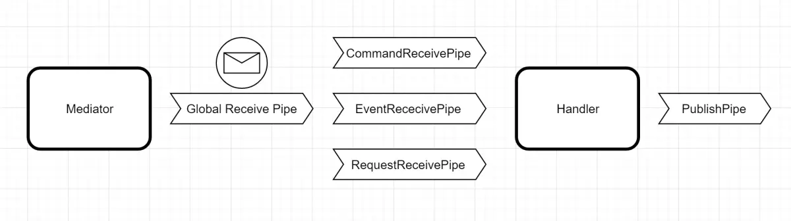

# [Mediator.Net][https://github.com/mayuanyang/Mediator.Net/tree/master]

1. 项目介绍

   - 专为.NET平台设计的中介者模式实现库，提供一种简洁、高效的方式来组织应用程序中的通信逻辑。

2. 核心特性

   - 简单易用：提供一组直观接口，如**ICommand**，**IRequest\<TReponse\>**和**IEvent**
   - 灵活性：支持多种注册方式，包括手动注册和扫描注册
   - 强大的管道系统：提供五种不同类型的接收管道（GlobalReceivePipeline, CommandReceivePipeline, EventReceivePipeline, RequestReceivePipeline 和 PublishPipeline），允许自定义中间件以扩展消息处理过程。
   - 异步编程：支持异步操作，保证高并发场景的性能和效率。

3. 简单例子

   ```c#
   // 无返回值
   await _mediator.SendAsync(new TestBaseCommand(Guid.NewGuid()));
   
   // 有返回值(command)：用于新增、更新、删除的请求
   var pong = await _mediator.SendAsync<Ping, Pong>(new Ping());
   
   // 有返回值(request)：用于查询请求
   var result = await _mediator.RequestAsync<GetGuidRequest, GetGuidResponse>(new GetGuidRequest(_guid));
   
   // 发布事件
   await _mediator.Publish(new OrderPlacedEvent);
   ```


- 编写Command：接受并处理命令。此外，还发布了产品产品事件。

  ```c#
  public class AddProductCommandHandler : ICommandHandler<CreateProductCommand, CreateProductResponse>
  {
      private readonly IProductService _productService;
  
      public AddProductCommandHandler(IProductService productService)
      {
          _productService = productService;
      }
  
      public async Task<CreateProductResponse> Handle(IReceiveContext<CreateProductCommand> context, CancellationToken cancellationToken)
      {
          var @event = await _productService.AddProductAsync(context.Message, cancellationToken)
              .ConfigureAwait(false);
  
          await context.PublishAsync(@event, cancellationToken).ConfigureAwait(false);
  
          return new CreateProductResponse
          {
              Result = @event.Result
          };
      }
  }
  
  public class CreateProductCommand : ICommand
  {
      public ProductDto Product { get; set; }
  }
  
  public class CreateProductResponse : IResponse
  {
      public string Result { get; set; }
  }
  ```

  

- 编写Event：负责处理产品创建事件

  ```c#
  public class ProductCreateEventHandler : IEventHandler<ProductCreatedEvent>
  {
      private readonly ILogger<ProductCreateEventHandler> _logger;
  
      public ProductCreateEventHandler(ILogger<ProductCreateEventHandler> logger)
      {
          _logger = logger;
      }
  
      public Task Handle(IReceiveContext<ProductCreatedEvent> context, CancellationToken cancellationToken)
      {
          _logger.LogInformation(context.Message.ToString());
  
          return Task.CompletedTask;
      }
  }
  
  public class ProductCreatedEvent : IEvent
  {
      public string Result { get; set; }
  }
  ```

  

- 编写Request：处理获取产品信息请求的请求处理器

  ```c#
  public class GetProductByIdRequestHandler : IRequestHandler<GetProductByIdRequest, GetProductByIdResponse>
  {
      private readonly IProductService _productService;
  
      public GetProductByIdRequestHandler(IProductService productService)
      {
          _productService = productService;
      }
  
      public async Task<GetProductByIdResponse> Handle(IReceiveContext<GetProductByIdRequest> context, CancellationToken cancellationToken)
      {
          return await _productService.GetProductByIdAsync(context.Message, cancellationToken).ConfigureAwait(false);
      }
  }
  
  public class GetProductByIdRequest : IRequest
  {
      public Guid Id { get; set; }
  }
  
  public class GetProductByIdResponse : IResponse
  {
      public ProductDto Product { get; set; }
  }
  ```


   1. 工作原理：注册Handler和信息（Message）之间的绑定，因此，收到特定信息则会找出对应的Handler进行处理。

   2. 模式区别

      - 传统模式：controller层接收请求后，引入不同的类并调用方法来完成目的。大量代码在controller中紧紧耦合，controller将越来越庞大和难以控制。
      - Mediator：controller只需要引入一个Mediator，由Mediator发送信息到达目的地（Handler），在Handler中进行上下文逻辑的处理，让功能逻辑单一独立出来，使得controller只需要消息的发送。

   3. 基本工作流

      - 一个Mediator可以发送多个sendAsync
      - 一个Handler可以接受处理多个Command
      - 一个Event可以发送处理多个Command

      

   4. 优点

      - 单一职责原则。 将多个组件间的交流抽取到同一位置， 使其更易于理解和维护。
      - 开闭原则。 无需修改实际组件就能增加新的中介者。
      - 减轻应用中多个组件间的耦合情况。
      - 更方便地复用各个组件。

   5. 缺点

      - 一段时间后， 中介者可能会演化成为[上帝对象](https://refactoringguru.cn/antipatterns/god-object)。

   6. 管道

      

      - Global Receive Pipe(全局接收管道)：在消息到达下一个管道和处理程序之前，只要有消息被发送、发布或请求，此管道就会被触发
      - CommandReceivePipe(命令接收管道)：该管道将在到达命令处理程序之后和之前触发`GlobalReceivePipeline`，该管道将仅用于`ICommand`
      - EventReceivePipe(事件接收管道)：该管道将在到达其事件处理程序之后和之前触发`GlobalReceivePipeline`，该管道将仅用于`IEvent`
      - RequestReceivePipe(请求接收管道)：该管道将在到达其请求处理程序之后和之前触发`GlobalReceivePipeline`，该管道将仅用于`IRequest`
      - PublishPipe(发布管道)：当处理程序内部发布时，此管道将被触发`IEvent`，此管道仅用于`IEvent`并且通常用作传出拦截器

   7. 自定义管道：实现IPipeSpecification<>接口

      - 实现部分方法的执行时机

        - **BeforeExecute**: 在消息处理程序执行之前运行。
        - **Execute**: 在消息处理程序执行过程中运行。
        - **AfterExecute**: 在消息处理程序执行完毕后运行。
        - **OnException**: 在消息处理过程中发生异常时运行。

执行顺序如下：

1. **Controller发送消息**:
   - 发送Command消息或Request消息到应用程序的业务逻辑层。
2. **消息进入UnitOfWork**:
   - 消息被传递到UnitOfWork单元（工作单元）。
3. **BeforeExecute进行前置处理**:
   - 在UnitOfWork中，消息进入BeforeExecute方法阶段进行前置增强。
4. **执行Execute方法**:
   - 在前置处理完成后，消息调用Execute方法。这一步将消息传递给相应的Handler处理消息完成具体的业务逻辑和数据库操作。
5. **AfterExecute进行后置处理**:
   - 处理程序执行完业务逻辑后，控制流程进入AfterExecute方法。其中，根据当前作用域ShouldSaveChanges的值，确定是否调用SaveChangesAsync方法，将操作保存到数据库中。


## Mediator.Net（补充）

### 三种通信机制

- command：常用于需要对数据库的数据进行增删改操作。使用SendAsync<TMessage, TResponse>(TMessage cmd,CancellationToken cancellationToken = default (CancellationToken))进行信息发送，Message与Handler相绑定，程序将根据Message将消息传递到相对应的Handler进行处理。
- event：发布/订阅模式。允许发布者在某些事情发生时通知多个订阅者。使用PublishAsync(IEvent message, CancellationToken cancellationToken = default (CancellationToken))进行消息的发布，Message也与Handler绑定，根据Message传递Handler处理。
- request：常用于数据库查询数据操作。使用RequestAsync<TRequest, TResponse>(TRequest request,CancellationToken cancellationToken = default (CancellationToken))进行信息发送，处理原理与上面一致。

> [!WARNING]
>
> 不同的TMessage类型需要实现不同的接口，如command需要实现ICommand接口，publish需要实现IRequest接口。

