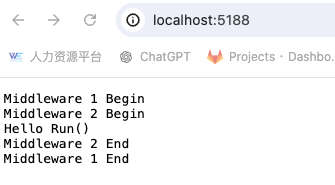
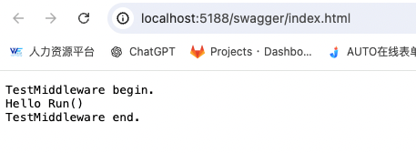
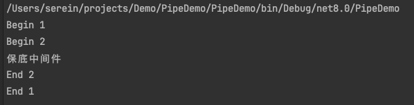

# C#

### 枚举类

枚举（Enum）是一个用于定义命名常量集合的类型。在C#中，枚举是一种特殊的值类型，通常用于表示一组相关的常量，如状态、选项等。枚举值本质上是整数，但它们可以使用易读的名称来表示。

```csharp
public enum UserQuestionStatusEnum
{
    Pending = 0,
    Annoying = 1,
    Noise = 2,
    ReadyToTrain = 3,
    Comeback = 4
}
```


### 反射

反射是C#中的一种机制，允许程序在运行时检查对象的类型、获取类型信息、创建对象和调用方法。反射提供了一种动态访问程序元数据的方式。

在代码中，反射通过类型（Type）对象和`System.Reflection`命名空间中的类来实现。反射通常用于以下场景：

1. 动态创建对象。
2. 访问和调用对象的成员（方法、属性等）。
3. 获取类型信息（如字段、方法、属性）。

通过使用反射则可以实现获取枚举类型的所有值

```csharp
var userQuestionStatuses = Enum.GetValues(typeof(UserQuestionStatusEnum)) // 使用反射获取枚举的所有值
    .Cast<UserQuestionStatusEnum>() // 将枚举值从object[]转换为UserQuestionStatusEnum类型
    .Select(status => new UserQuestionStatusDto // 创建UserQuestionStatusDto对象
    {
        Value = (int)status, // 获取枚举的整数值
        Text = status.ToString() // 获取枚举的名称
    })
    .ToList(); // 将结果转换为列表
```


# Startup.cs文件浅析

1. 作用：配置服务和应用程序的请求管道

2. 方法执行顺序：构造函数 => ConfigureServices => ConfigureContainer(如果有使用Autofac这样的第三方DI容器的话) => Configure

   - 构造函数：初始化配置

   - ConfigureServices：注册服务到“IServiceCollection”。

   - ConfigureContainer（可选）：配置第三方DI容器

   - Configure：配置中间件管道。中间件管道配置顺序需要注意，如果配置不当会导致相应业务出现问题。

     ```c#
     // 错误示例
     // UseEndpoints这个中间件定义了应用程序的终结点和它们如何传入请求，负责处理请求。
     app.UseEndpoints(endpoints => endpoints.MapControllers());
     // UseRouting这个中间件负责处理传入请求的路由信息，本身不处理请求。
     app.UseRouting();
     
     // 如果按照上述配置的话，路由信息不会被正确解析，导致终结点无法正常工作。
     ```

     

# 管道机制

.png)

- 一个请求进来会经历一个个中间件直到到达终结点，最后再返回出去，顺序类似于栈的先进后出。


1. 什么是管道？（这里以.Net的请求管道（Request Pipeline）为例）

   

   如图所示，请求管道（Request Pipeline）是一个由一个或多个中间件（Middleware）组成的请求处理管道。每个中间件都可以对传入管道的请求（Request）进行处理，并且在处理完之后可以选择将请求传递给下一个中间件。最终，中间件可以生成响应（Response)并将其返回给客户端。

   多个中间件是使用多个 `Use` 方法链接在一起的。每个中间件都可以通过调用 `next()` 方法将请求传递给下一个中间件。如果某个中间件不调用 `next()`，则会导致请求处理短路，使当前中间件成为终结点。这样子，请求将会从当前中间件返回出去，而传递到下一个中间件。

2. 执行顺序

   执行顺序类似于栈的**先进后出**顺序。当一个请求进来时，它首先经过每一层中间件的前置处理，然后通过调用 `next()` 函数传递到下一个中间件。最后，请求到达管道的终结点。

   在终结点生成响应后，响应会按照与请求相反的方向返回，通过每一层中间件进行处理。中间件可以在这个过程中对响应数据进行填充和修改。最终，完整的响应返回给客户端。	


## 中间件

1. 职责：

   - 选择是否将请求转发到下个中间件。如果选择不转发，则会造成短路。
   - 在管道中的下一个中间件的前后执行工作

   补充：

   - **短路**：短路是将某个中间件变为终结点。有些中间件需要短路操作是必要的。例如，权限校验中间件在权限不通过时会阻止请求继续传递，以确保安全性。

2. 中间件配置（Startup.cs）

   - 中间件配置最终会调用**IApplicationBuilder**提供的**Use**方法

   ```c#
   // 配置Startup.cs里面的Configure进行中间件配置
   public void Configure(IApplicationBuilder app, IWebHostEnvironment env)
       {
           app.Use(async (context, next) =>
           {
               context.Response.WriteAsync("Middleware 1 Begin\n");
               await next();
               context.Response.WriteAsync("Middleware 1 End\n");
           });
           app.Use(async (context, next) =>
           {
               context.Response.WriteAsync("Middleware 2 Begin\n");
               await next();
               context.Response.WriteAsync("Middleware 2 End\n");
           });
     
     			// Run方法本质是Use的包装,Use方法不调用next()就是Run方法
           app.Run(async context =>
           {
               context.Response.WriteAsync("Hello Run()\n");
           });
       }
   ```

   运行结果：

3. 自定义中间件

   - 具有类型为RequestDelegate的参数的公共构造函数
   - 名为Invoke或InvokeAsync的公共方法，且方法必须满足两个条件：返回Task；接收类型HttpContext的第一个参数
   - 测试Demo

   ```c#
   class TestMiddleware
   {
       private readonly RequestDelegate _next;
   
     	// 如果需要其他依赖注入则需要在Startup中的ConfigureServices方法中将该依赖进行注入
       public TestMiddleware(RequestDelegate next)
       {
           _next = next;
       }
   
       public async Task InvokeAsync(HttpContext httpContext)
       {
           await httpContext.Response.WriteAsync("TestMiddleware begin.\n");
           await _next(httpContext);
           await httpContext.Response.WriteAsync("TestMiddleware end.\n");
       }
       
   }
   
   // 在Startup.cs中的Configure方法配置该中间件
   public void Configure(IApplicationBuilder app, IWebHostEnvironment env)
       {
           app.UseMiddleware<TestMiddleware>();
           
           app.Run(async context =>
           {
               context.Response.WriteAsync("Hello Run()\n");
           });
       }
   ```

   运行结果：

4. 模拟管道Demo

   - Demo地址：https://github.com/mason-c89/Demo/tree/main/PipeDemo/PipeDemo
   - 运行结果：
   - 解释说明
     1. _components本质上是储存独立的中间件的列表，在调用Use方法时将各中间件添加进去
     2. 中间件建立联系是在 `Build` 方法的 `for` 循环中完成的。例如，将保底中间件传递给第二个中间件的委托，然后返回第二个中间件，形成了第二个中间件与保底中间件的联系，构成了一条链。（可参考**责任链**模式）


- 请求-响应处理：中间件可以对传进来的请求（Request）以及返回给客户端的响应（Response）进行处理，如鉴权、日志记录等。
- 链式调用：每个中间件处理完请求后，可以选择将请求传递给下一个中间件。
- 可插拔性和可配置性：可以根据需要配置中间件的顺序和行为，从而灵活定制请求处理流程。
- 前置处理：在请求传递到下一个中间件或最终处理程序之前执行。
- 后置处理：在响应传递回客户端之前执行，通常在下一个中间件完成其处理之后。


## 1. Startup构造函数

- 使用Generic Host（IHostBuilder）时，Startup的构造函数只支持注入IWebHostEnvironment，IHostEnvironment和IConfiguration，[微软官方文档](https://learn.microsoft.com/en-us/aspnet/core/fundamentals/startup?view=aspnetcore-3.1#the-startup-class)。
- 查看[创建Startup实例源码](https://github.com/dotnet/aspnetcore/blob/v8.0.7/src/Hosting/Hosting/src/GenericHost/GenericWebHostBuilder.cs#L235)就能发现，其实该源码本质上是现有的 `IServiceProvider` 实例（即 `HostServiceProvider`）来创建 `startupType` 类型的实例。
- 查看[IServiceProvider实现源码](https://github.com/dotnet/aspnetcore/blob/v8.0.7/src/Hosting/Hosting/src/GenericHost/GenericWebHostBuilder.cs#L360)能看到，HostServiceProvider实现了IServiceProvider的GetService方法并做了判断，只有满足这几种类型才能返回具体的实例注入，其他不满足条件的类型都会返回null。

## 2. ConfigureServices的装载

- 查看[查找并执行ConfigureServices方法源码](https://github.com/dotnet/aspnetcore/blob/v8.0.7/src/Hosting/Hosting/src/GenericHost/GenericWebHostBuilder.cs#L239)，能发现，其实具体步骤就分三步，首先在startupType类型中根据环境变量名称查找具体方法返回ConfigureServicesBuilder实例，然后构建ConfigureServicesBuilder实例返回ConfigureServices方法的委托，最后传递IServiceCollection对象执行委托方法。
- 查看[FindConfigureServicesDelegate源码](https://github.com/dotnet/aspnetcore/blob/v8.0.7/src/Hosting/Hosting/src/Internal/StartupLoader.cs#L311C46-L311C75)，这个方法是在startupType类型里去查找名字为environmentName构建的Configure{0}Services的方法信息，然后根据查找的方法信息即MethodInfo对象去构建ConfigureServicesBuilder实例。
- 查看[MethodInfo源码](https://github.com/dotnet/aspnetcore/blob/v8.0.7/src/Hosting/Hosting/src/Internal/StartupLoader.cs#L318C32-L318C42)，该方法流程是首先ConfigureServices方法的名称可以是包含环境变量的名称比如(ConfigureDevelopmentServices)，其次方法可以为共有的静态或非静态方法。
- 查看[ConfigureServicesBuilder类源码](https://github.com/dotnet/aspnetcore/blob/v8.0.7/src/Hosting/Hosting/src/Internal/ConfigureServicesBuilder.cs)，其查找并执行ConfigureServices逻辑是:
  - 查找ConfigureServices方法，即包含环境变量的`ConfigureServices`方法名称比如(`ConfigureDevelopmentServices`)或名为`ConfigureServices`的方法，返回的是`ConfigureServicesBuilder`对象。
  - 执行ConfigureServicesBuilder的Build方法，这个方法里包含了执行ConfigureServices的规则，即ConfigureServices只能包含一个参数且类型为`IServiceCollection`，
  - 将当前程序中存在的`IServiceCollection`实例传递给它。


## 3. Configure的装载

我们通常使用Startup的Configure方法去配置中间件，默认的Configure注入了`IApplicationBuilder`和`IWebHostEnvironment`实例，但其实Configure不止可以传递这两个参数，还可以通过参数注入在IServiceCollection中注册的所有服务 [[参考源码]](https://github.com/dotnet/aspnetcore/blob/v8.0.7/src/Hosting/Hosting/src/GenericHost/GenericWebHostBuilder.cs#L256)。

其中，源码中[`FindConfigureDelegate`](https://github.com/dotnet/aspnetcore/blob/v8.0.7/src/Hosting/Hosting/src/Internal/StartupLoader.cs#L294)方法的逻辑与之前差不多，这里不过多叙述，主要查看[ConfigureBuilder类](https://github.com/dotnet/aspnetcore/blob/v8.0.7/src/Hosting/Hosting/src/Internal/ConfigureBuilder.cs)的源码。

可以发现其源码逻辑与之前差不多，但参数校验上，加了个if语句来进行IApplicationBuilder和ServiceProvider上已注册服务的实例注入。


# .Net 容器

## 内置IOC

1. 内置IOC有三种生命周期：Transient、Scoped、Singleton

2. 在Startup里的ConfigureServices方法中对实例进行注册，三种生命周期分别对应的方法是：AddTransient、AddScoped、AddSingleton

3. 常见注入：

   - 直接注入IServiceProvider：`serviceProvider.GetService<SingletonService>();`

   - **构造函数注入(推荐)**：

     ```c#
     public HomeController(ISingletonService singletonService)
      {
          var _singletonService =singletonService;
      }
     ```

   - 集合方式注入：

     ```c#
     services.AddSingleton<ISingletonService, SingletonService1>();
     services.AddSingleton<ISingletonService, SingletonService2>();
     
     
     public HomeController(IEnumerable<ISingletonService> services)
     {
         var singletoService1 = services.First();
         var singletoService2 = services.Skip(1).First();
     }
     ```

   - 工厂方式注入：

     ```c#
     services.AddSingleton(provider =>
     {
         Func<int, ISingletonService> func = n =>
         {
             switch (n)
             {
                 case 1:
                     return provider.GetService<SingletonService1>();
                 case 2:
                     return provider.GetService<SingletonService2>();
                 default:
                     throw new NotSupportedException();
             }
         };
         return func;
     });
     
     public HomeController(Func<int, ISingletonService> funcFactory)
     {
         var singletonService1 = funcFactory(1);
         var singletonService2 = funcFactory(2);
     }
     ```

     