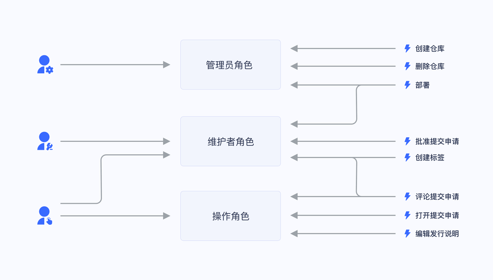

#  Jwt

## Jwt概述

### Jwt是什么

​	Jwt全称Json Web Token，译为“Json网络令牌”，它可以以紧凑、URL安全的方式在各方之间传递claims（声明）。在Jwt中，claims被编码为Json对象，用作Jws(Json Web Signature)结构的负载（payload），或作为Jwe（Json Web Encryption）结构的明文，这就使得声明可以使用MAC（Message Authentication Code）进行数字签名或完整性保护和加密。

### 作用

- **跨站**：相较于传统的cookie只能实现跨域，Jwt原生支持跨域、跨站，因为它要求每次请求时，都要在请求头中携带token。
- **跨服务器**：如果应用采用集群部署的情况下，传统的cookie+session的认证方式，为了实现session跨服务器共享，还必须引入分布式缓存中间件（Redis）。而Jwt不需要，因为它可以不存储在服务器端。
- **Native App友好**：对于原生平台（如iOS、Android、WP）的App，没有浏览器的支持，Cookie丧失了它的优势，而使用Jwt就很简单。

### 结构

```
xxxxx.yyyyy.zzzzz
```

可以看出Jwt由三部分构成，用`.`隔开。从左到右3部分称为：头部（Header）、载荷（Payload）和签名（Signature）。

- **头部**：主要用于说明token类型和签名算法。
- **载荷**：主要用于存储声明信息，如token签发者、用户Id、用户角色等。
- **签名**：主要用于防止token被篡改。当服务端获取到token时，会按照算法计算签名，若计算出的与token中的签名一致，才认为token没有被篡改。

### Jwt带来了什么问题

#### 不安全

所谓的“不安全”，是指Jwt的Payload是明文（Base64Url编码），因此其不能存储敏感数据。

不过，我们可以针对生成的token，再进行一次加密，这样相对会更加安全一些。不过无论如何，还是不如将数据保存在服务端安全。

#### 长度太长

哪怕只在token中存储了少量必要信息，但是生成的token字符串长度仍然很长。而用户每次发送请求时，都会携带这个token，在一定程度上来看，开销是较大的，不过一般可以忽略这点性能开销。

#### 无状态 & 一次性

jwt最大的特点是无状态和一次性，这也就导致如果想要修改里面的内容，必须重新签发一个新的token。因此，也就引出了另外的两个问题：

- 无法手动过期
  如果我们想要使已签发的jwt失效，除非达到它的过期时间，否则是无法手动让其失效的。
- 无法续签
  假设签发了一个有效时长30分钟的token，用户在这30分钟内持续进行操作，当达到token的有效期时，我们希望能够延长该token的有效期，而不是让用户重新登录。显然，要实现这个效果，必须要重新签发一个新的token，而不是在原token上操作。


## Bearer概述

HTTP提供了一套标准的身份认证方案：当身份认证不通过时，服务端可以向客户端发送`质询(challenge)`，客户端根据质询提供身份验证凭证进行应答。

流程如下：

1. 当身份认证不通过时，服务端向客户端返回HTTP状态码`401（Unauthorized，未授权）`，并在`WWW-Authenticate`头中添加如何提供认证凭据的信息，其中至少包含有一种质询方式。
2. 客户端根据质询，在请求头中添加`Authorization`，它的值就是进行身份认证的凭证。

```
     +--------+                               +---------------+
     |        |--(A)- Authorization Request ->|   Resource    |
     |        |                               |     Owner     |
     |        |<-(B)-- Authorization Grant ---|               |
     |        |                               +---------------+
     |        |
     |        |                               +---------------+
     |        |--(C)-- Authorization Grant -->| Authorization |
     | Client |                               |     Server    |
     |        |<-(D)----- Access Token -------|               |
     |        |                               +---------------+
     |        |
     |        |                               +---------------+
     |        |--(E)----- Access Token ------>|    Resource   |
     |        |                               |     Server    |
     |        |<-(F)--- Protected Resource ---|               |
     +--------+                               +---------------+

                     Abstract Protocol Flow
```

Bearer认证中的凭据称为`Bearer Token`，或称为`access token`，标准请求格式为（添加到HTTP请求头中）：

```plsql
Authorization: Bearer [Access Token]
```


# 权限模型

## RBAC

- 基于角色的访问控制（Role-based access control，简称 RBAC），指的是通过用户的角色（Role）授权其相关权限，这实现了更灵活的访问控制，相比直接授予用户权限，要更加简单、高效、可扩展。

  

  当使用 RBAC 时，通过分析系统用户的实际情况，基于共同的职责和需求，授予他们不同角色。你可以授予给用户一个或多个角色，每个角色具有一个或多个权限，这种 用户-角色、角色-权限 间的关系，让我们可以不用再单独管理单个用户，用户从授予的角色里面继承所需的权限。

  

  - 以一个简单的场景（Gitlab 的权限系统）为例，用户系统中有 Admin、Maintainer、Operator 三种角色，这三种角色分别具备不同的权限，比如只有 Admin 具备创建代码仓库、删除代码仓库的权限，其他的角色都不具备。

  

  我们授予某个用户「Admin」这个角色，他就具备了「创建代码仓库」和「删除代码仓库」这两个权限。

  不直接给用户授权策略，是为了之后的扩展性考虑。比如存在多个用户拥有相同的权限，在分配的时候就要分别为这几个用户指定相同的权限，修改时也要为这几个用户的权限进行一一修改。有了角色后，我们只需要为该角色制定好权限后，给不同的用户分配不同的角色，后续只需要修改角色的权限，就能自动修改角色内所有用户的权限。

  

## ABAC

- 基于属性的访问控制（Attribute-Based Access Control，简称 ABAC）是一种非常灵活的授权模型，不同于 RBAC，ABAC 则是通过各种属性来动态判断一个操作是否可以被允许。

- 在 ABAC 中，一个操作是否被允许是基于对象、资源、操作和环境信息共同动态计算决定的。

  - 对象：对象是当前请求访问资源的用户。用户的属性包括ID，个人资源，角色，部门和组织成员身份等；
  - 资源：资源是当前访问用户要访问的资产或对象（例如文件，数据，服务器，甚至API）。资源属性包含文件的创建日期，文件所有者，文件名和类型以及数据敏感性等等；
  - 操作：操作是用户试图对资源进行的操作。常见的操作包括“读取”，“写入”，“编辑”，“复制”和“删除”；
  - 环境：环境是每个访问请求的上下文。环境属性包含访问尝试的时间和位置，对象的设备，通信协议和加密强度等。

- 例如，策略「当一个文档的所属部门跟用户的部门相同时，用户可以访问这个文档」会被以下属性匹配：

  - 对象（用户）的部门 = 资源的所属部门；
  - 资源 = “文档”；
  - 操作 = “访问”；

  策略「早上九点前禁止 A 部门的人访问B系统；」会被以下属性匹配：

  - 对象的部门 = A 部门；
  - 资源 = “B 系统”；
  - 操作 = “访问”；
  - 环境 = “时间是早上 9 点”。