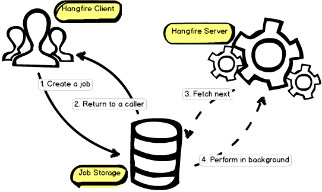

# IOC容器

## 重复注册问题

**问题**：在 `Startup` 中使用 `AddJwt` 注册单例实例，并在 Autofac 中通过接口扫描重复注册相同类型实例，可能导致实例覆盖和依赖注入不一致问题。

**处理方法**：选择在 `Startup` 或 Autofac 中注册单例实例，不要重复注册。


# Respawner

## 清除所有表数据问题

**问题**：使用 Respawner 进行数据库数据清除时，意外清除了其他库的表数据。

**原因**：Respawner 是根据用户权限扫描数据库表，而不是根据连接字符串。我使用了 root 用户连接数据库，由于其权限过大，导致所有数据库的表都被扫描。

**处理方法**：

- 配置 `SchemasToInclude` 属性来指定只包含测试数据库的表。
- 使用权限较小的用户进行连接。


# Hangfire

## 概述

- Hangfire允许以一种简单可靠的方式在请求处理管道之外启动方法调用。这些方法调用在后台线程中执行，称为后台作业。

- 大致来看，该库由三个主要组件组成：客户端（Hangfire Client）、存储（Job Storage）和服务器（Hangfire Server）组成。主要流程如下图：

  

### Client

- Hangfire 支持创建各种类型的后台作业，包括：
  - **一次性作业**（Fire-and-forget）：用于立即执行的方法调用。
  - **延迟作业**（Delayed）：用于在指定时间后执行的方法调用。
  - **周期性作业**（Recurring）：用于按设定的时间间隔重复执行的方法调用。

- 使用 Hangfire 不需要创建特殊的类。后台作业基于常规的静态或实例方法调用即可。

  ```c#
  var client = new BackgroundJobClient();
  
  client.Enqueue(() => Console.WriteLine("Easy!"));
  client.Delay(() => Console.WriteLine("Reliable!"), TimeSpan.FromDays(1));
  ```

  

- 另外，可以使用 `BackgroundJob` 类中的静态方法来更简便地创建任务。

  ```c#
  BackgroundJob.Enqueue(() => Console.WriteLine("Hello!"));
  ```

- 客户端的主要职责是创建任务。它将任务信息（不是委托，而是表达式树）进行序列化，然后存储在指定的存储中（如 Redis、SQL Server 等）。

### Storage

Hangfire 将后台作业和其他与持久存储中的处理相关的信息保存起来。持久性有助于后台作业在应用程序重新启动、服务器重新启动等情况下继续存在。这是使用 CLR 的线程池和 Hangfire 执行后台作业之间的主要区别。支持不同的存储后端：

- SQL Azure, SQL Server, MySQL等
- Redis

```
GlobalConfiguration.Configuration.UseSqlServerStorage("db_connection");
```

### Server

- 后台作业由 Hangfire Server 处理。它是作为一组专用（不是线程池的）后台线程实现的，这些线程从存储中获取作业并处理它们。服务器还负责保持存储清洁并自动删除旧数据。

- Hangfire 对每个存储后端使用可靠的获取算法，因此可以在 Web 应用程序内开始处理，而不会面临在应用程序重新启动、进程终止等情况下丢失后台作业的风险。


## Enqueue

```c#
BackgroundJob.Enqueue(() => Console.WriteLine("Hello, world!"));
```

`Enqueue`方法不会立即调用目标方法，而是运行以下步骤：

1. 序列化方法信息及其所有参数
2. 根据序列号信息创建新的后台作业
3. 将后台作业保存到Storage中
4. 将后台作业排队到其队列中

执行这些步骤后， `BackgroundJob.Enqueue` 方法立即返回给调用者。Hangfire Server检查持久存储中是否有排队的后台作业并以可靠的方式执行它们。

排队作业由专门的工作线程池处理，每个worker都会调用以下流程：

1. 获取下一份作业并对其他woker隐藏
2. 执行作业及其所有扩展过滤器
3. 从队列中删除作业

⚠️ 只有成功处理作业后，作业才会被删除。即使在执行过程某个进程被终止，Hangfire也会执行补偿逻辑来保证每个作业的处理。


### Schedule

```c#
BackgroundJob.Schedule(
    () => Console.WriteLine("Hello, world"),
    TimeSpan.FromDays(1));
```

Hangfire Server 定期检查计划，将计划的作业排入其队列，从而允许工作人员执行它们。默认情况下，检查间隔为 `15 s` ，但可以通过在传递给 `BackgroundJobServer` 构造函数的选项上设置 SchedulePollingInterval 属性来更改它：

```c#
var options = new BackgroundJobServerOptions
{
    SchedulePollingInterval = TimeSpan.FromMinutes(1)
};

var server = new BackgroundJobServer(options);
```

⚠️ 执行延迟作业需要注意以下事项：

- 禁用空闲超时 – 将其值设置为 `0` 。
- 使用应用程序自动启动功能。


### Recurrent

```c#
RecurringJob.AddOrUpdate("easyjob", () => Console.Write("Easy!"), Cron.Daily);
```

该行在Storage中创建一个新作业。 Hangfire Server 中的一个特殊组件将会以分钟为基础检查重复作业，然后将它们作为“一次性”作业排入队列。这使能够像往常一样跟踪它们。

该方法的第一个参数为标识符，每个重复作业必须使用唯一标识符，否则该作业将以单次作业结束。另外，在某些Storage中，标识符可能区分大小写。

该方法的第二个参数为Cron表达式。该作业将遵循Cron表达式去运行作业。Cron类包含不同方法和重载，可以按分钟、每小时、每天、每周、每月和每年运行作业，也可以制定更复杂的规则去执行计划。

- 删除现有重复作业可以使用`RemoveIfExists`方法。当没有此类重复作业时，不会引发异常。

  ```c#
  RecurringJob.RemoveIfExists("some-id");
  ```

- 如果要立即运行重复作业，可以使用`Trigger`方法。周期性作业本身不会记录触发调用信息，也不会从本次运行中重新计算下次执行时间。例如，如果您有一项在周三运行的每周作业，并且您在周五手动触发它，它将在下周三运行。

  ```c#
  var manager = new RecurringJobManager();
  manager.AddOrUpdate("some-id", Job.FromExpression(() => Method()), Cron.Yearly());
  ```

  