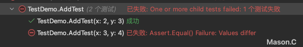
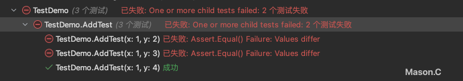
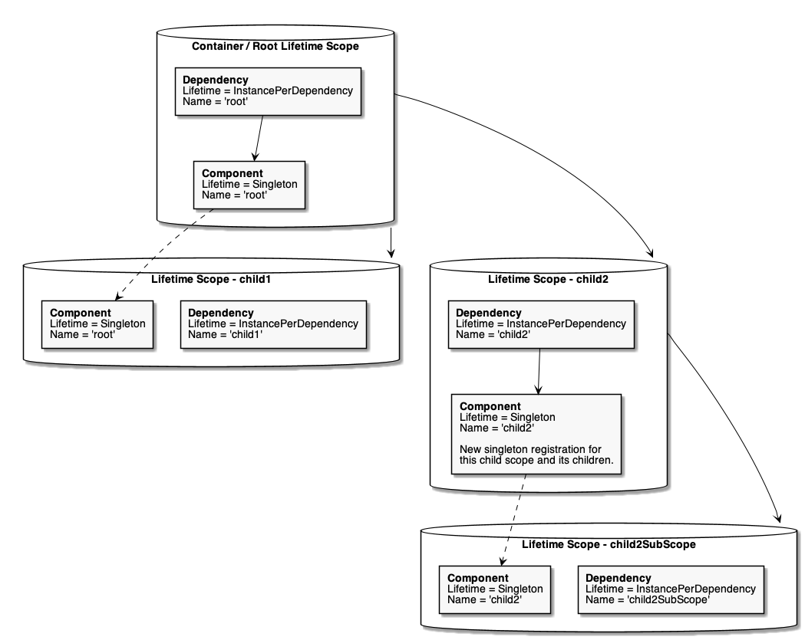

# xUnit.Net

简介：单元测试框架。提供了Attribute（为测试方法或类添加元数据）和Assertion（判断测试结果与预期结果是否符合）两个方面的功能。

### @Attribute

- [Fact]：被该标签标记的测试方法，是不需要接收参数的。Fact标签可以接受两个参数，一个是DisplayName，设置Test Case名称。另一个是Skip，如果设置了这个属性，则不运行该Test Case。

- [Theory]：被该标签标记的测试方法，是有参数列表，也就是输入的参数值是会改变的。继承于Fact，和Fact一样拥有同样的两个参数。

- [InlineData]：顾名思义就是定义一行数据，作为输入参数注入测试方法中。

  ```c#
  // 假设测试用例名为AddTest，接收两个int参数
  public class TestDemo
  {
      [Theory(DisplayName = "TestDemo.AddTest")]
      [InlineData(2,3)]
      [InlineData(3,4)]
      public void AddTest(int x, int y){
          Assert.Equal(5, x + y);
      }
  }
  ```

  运行结果：


- [MemberData]：数据量大时，使用InlineData就会使代码变得特别长，可以使用MemberData完成数据注入，同时，数据集由外部传入时，也可以使用MemberData去完成数据注入。MemberData接收两个参数：第一、方法名；第二、参数列表（方法名的参数列表）。

  - 基本使用，通过构造方法来批量传递数据。

    ```c#
    public class TestDemo
    {
        [Theory(DisplayName = "TestDemo.AddTest")]
        [MemberData("AddTestDataList")]
        public void AddTest(int x, int y){
            Assert.Equal(5, x + y);
        }
    
        public static IEnumerable<object[]> AddTestDataList()
        {
            var dataList = new List<object[]>();
            
            dataList.Add(new object[] {1,2});
            dataList.Add(new object[] {1,3});
            dataList.Add(new object[] {1,4});
    
            return dataList;
        }
    }
    ```

    运行结果：

    **注意：**

    1. 为MemberData提供数据的方法必须是静态的
    2. 该方法返回的数据类型应该是**IEnumerable<object[]>**
    3. 如果该方法需要传入参数，则在MemberData传入方法名后面再传入参数即可，比如[MemberData("AddTestDataList", true)]


## NSubstitute

- Returns()方法
  - 使用：假设构建需要Service来使用，其中属性dataProvider需要属性注入，则可以使用Substitute.For<>()进行mock，而后调用构造函数实例化Service。而在测试Service方法时，需要用到dataProvider里面的函数调用，则可以使用Returns()方法来指定返回值，因为dataProvider是mock出来的，里面的方法是没有具体实现的，所以需要使用Returns()方法进行返回值设置。
  - 踩坑1：由于我的Service里还需要使用AutoMapper，直接mock一个IMapper接口又没有具体作用。使用了`MapperConfiguration`类引入之前封装好的profile进行mapper的实例化。运行测试方法时会报错，因为之前设置了`_mapper.Received(1).Map()`方法导致，修改后的mapper是可以使用的有具体逻辑的实例，不再是NSubstitute的代理对象，则不支持NSubstitute提供的扩展方法了。
  - 踩坑2：我在使用Returns时，需要去给dataProvider的一个设置返回值，最开始代码为`dataProvider.CreateAsync(product, Arg.Any<CancellationToken>()).Returns(1);`，其中product为我自己设置好的实例化后一个值。但启动测试方法，这个`CreateAsync`方法一直返回0。研究NSubstitute如何拿到Returns返回值的原理发现，可能是传入的参数没匹配上导致。后改成`_dataProvider.CreateAsync(Arg.Any<Product>(), Arg.Any<CancellationToken>()).Returns(1)`就成功返回1了。
  - 原理：每当 `Returns` 方法被调用时，NSubstitute 会记录该方法调用的定义以及设置的返回值。当这个方法被调用时，NSubstitute 会返回最近设置的返回值。具体来说，NSubstitute 使用一个内部的机制来追踪每个方法调用及其对应的返回值。通过这种方式，它可以模拟对象的行为，而不需要实际的实现逻辑。[参考网页](https://stackoverflow.com/questions/39410333/how-does-nsubstitute-returnst-work)


# 集成测试

## 各测试文件作用

| 文件名              | 作用                                                         |
| ------------------- | ------------------------------------------------------------ |
| IntegrationFixture  | 提供动态配置、依赖注入和数据库管理功能                       |
| IntegrationTestBase | 提供了依赖注入、作用域管理和便捷的方法以执行带有依赖项和事务支持的异步操作。 |
| IntegrationUtilBase | 继承了 `IntegrationTestBase`，并通过其构造函数设置依赖注入的作用域 |


## 如何在集成测试中使用autofac实现依赖注入

1. **创建服务集合并添加需要的服务**：首先，创建一个 `ServiceCollection` 实例并添加需要的服务（例如，日志记录）。

   ```c#
   var serviceCollection = new ServiceCollection();
   serviceCollection.AddLogging(l => {
       l.AddConsole();
   });
   ```

   

2. **创建 Autofac 容器构建器并将服务集合填充到容器中**：使用 `ContainerBuilder` 将 `ServiceCollection` 中的服务填充到 Autofac 容器中。

   ```c#
   var containerBuilder = new ContainerBuilder();
   containerBuilder.Populate(serviceCollection);
   ```

   

3. **注册自定义配置**：通过自定义方法创建和注册配置。

   ```c#
   var configuration = RegisterConfiguration(containerBuilder);
   
   private IConfiguration RegisterConfiguration(ContainerBuilder containerBuilder)
   {
     var target = $"appsettings_{_topic}.json";
     File.Copy("appsettings.json", target);
   
     dynamic json = JsonConvert.DeserializeObject(target) ?? throw new InvalidOperationException();
     json["ConnectionStrings"]["Default"] = json["ConnectionStrings"]["Default"].ToString()
     			.Replace("database=db_practise_mason", $"database=db_practise_mason_{_databaseName}");
           
     File.WriteAllText(target, JsonConvert.SerializeObject(json));
           
     var configuration = new ConfigurationBuilder().AddJsonFile(target).Build();
     containerBuilder.RegisterInstance(configuration).AsImplementedInterfaces();
     return configuration;
   }
   ```

   

4. **构建容器并管理生命周期**：构建 Autofac 容器并在每次测试中开始一个新的生命周期范围。

   ```c#
   CurrentScope = container.BeginLifetimeScope();
   ```

   注意：生命周期范围不仅影响组件的生存时间，还影响组件获取依赖项的位置。

   

## IntegrationTestBase

- 提供了依赖注入、作用域管理和便捷的方法以执行带有依赖项和事务支持的异步操作。

1. 依赖注入：通过Autofac容器管理依赖项，允许在测试中灵活地注册和解析依赖项。

2. 作用域管理：利用`ILifetimeScope`管理对象的生命周期，确保在不同测试之间的依赖项隔离。

3. 异步操作：提供多种`Run`方法，支持带有单个或多个依赖项的异步操作执行。

4. 事务支持：通过`RunWithUnitOfWork`方法，在执行操作后自动保存工作单元的变更，确保事务一致性。

   

## IntegrationUtilBase

- 基于`IntegrationTestBase`类，进一步简化了依赖注入和作用域管理的初始化过程。

1. 继承自`IntegrationTestBase`：利用父类提供的所有依赖注入和作用域管理功能。
2. 初始化：在构造函数中通过调用父类的构造函数并设置作用域，简化了测试类的初始化流程。


## 编写测试

- 这里以Product的增删改查为例

### 编写Util类

- 专用于处理`Product`相关的操作，继承自`IntegrationUtilBase`类，简化操作实现。

1. **继承自`IntegrationUtilBase`**：继承了所有依赖注入和作用域管理功能。

2. **添加产品功能（例）**：通过`AddProduct`方法，利用UnitOfWork事务支持和依赖注入，便捷地添加新的产品。

   ```c#
   		public async Task AddProduct(Guid id, string name, decimal price)
       {
           await RunWithUnitOfWork<IRepository>(async repository =>
           {
               await repository.InsertAsync(new Product
               {
                   Id = id,
                   Name = name,
                   Price = price
               });
           });
       }
   ```

   

### 编写FixtureBase类

- 继承自`IntegrationFixture`类，专门用于设置产品相关的测试环境。

1. **继承自`IntegrationFixture`**：利用父类提供的初始化和配置功能。

2. **构造函数初始化**：在构造函数中指定数据库名称和测试数据库名称

   ```c#
   public class ProductFixtureBase : IntegrationFixture
   {
       public ProductFixtureBase() : base("product", "product_test")
       {
       }
   }
   ```

   

### 编写Fixture类

#### ProductFixture

- 继承自`ProductFixtureBase`，专门用于对产品相关的服务进行集成测试。
- 提供了对产品的增、查、改、删操作的测试方法。

##### 类结构解释

1. 继承自`ProductFixtureBase`
   - `ProductFixture`类继承了`ProductFixtureBase`的功能，利用其配置好的测试环境。
2. `ProductUtil`实例`_util`
   - 在构造函数中初始化`_util`，利用`ProductUtil`类提供的方法简化产品操作。

##### 测试方法(代码过长，这里就不贴上实现代码)

1. `ShouldGetProductAsync`
   - 添加一个产品后，通过`mediator`发送请求来获取该产品，并验证其属性。
2. `ShouldAddProductAsync`
   - 使用`Theory`和`ClassData`特性，测试添加产品的功能。先添加产品，再获取产品并验证其属性。
3. `ShouldUpdateProductAsync`
   - 先添加产品，然后更新产品的属性，再获取产品并验证更新后的属性。
4. `ShouldDeleteProductAsync`
   - 先添加产品，然后删除产品，再尝试获取产品并验证其已被删除。
5. `ShouldGetAllProductAsync`
   - 添加一个产品后，通过`mediator`发送请求来获取所有产品，并验证结果列表中的产品属性。

### 编写Data类

- 由于部分测试方法需要使用复杂对象，而`[InlineData]`不支持复杂对象的注入，并且`[MemberData]`在测试类中编写数据源不够灵活，因此使用了`[ClassData]`特性，并编写了一个数据源提供类。

#### ProductDtoData

- 实现了`IEnumerable<object[]>`接口，用于生成测试数据，特别是为`Xunit`的`Theory`测试提供数据。

### 优化

修改前：更新和删除的测试方法是先调用**mediator**的方法进行数据插入，确认数据插入无误后，再进行更新和删除测试。每次测试更新或删除操作时，都需要重新开启一个Run方法，确保和插入数据不是采用同一个事务。

修改后：现在插入操作改为使用Util类中的插入方法。Util类提供了简单的插入工具，减少了对mediator的依赖，确保了插入操作的稳定性和一致性。插入完成后，直接进行更新和删除测试，不再需要重新开启Run方法。


# Respawner

## 清除所有表数据问题

**问题**：使用 Respawner 进行数据库数据清除时，意外清除了其他库的表数据。

**原因**：Respawner 是根据用户权限扫描数据库表，而不是根据连接字符串。我使用了 root 用户连接数据库，由于其权限过大，导致所有数据库的表都被扫描。

**处理方法**：

- 配置 `SchemasToInclude` 属性来指定只包含测试数据库的表。
- 使用权限较小的用户进行连接。
