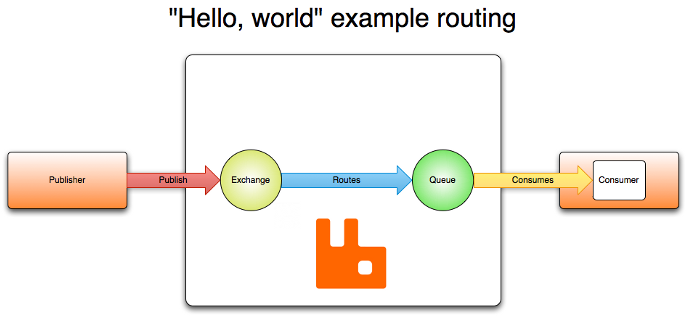
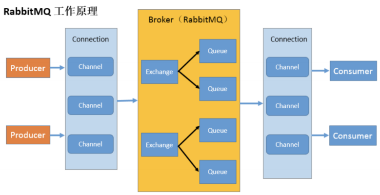

# MQ相关概念

## 什么是MQ

MQ（Message Queue），即消息队列，从字面意思来看，本质上是一个队列，采用**FIFO（先入先出）**原则，只不过队列中存放的是消息。它是一种跨进程的通信机制，用于上下游系统之间传递消息。

## 为什么要用MQ

1. **流量削峰**

   举个例子，如果订单系统最多能处理一万次订单，这个处理能力在正常时段绰绰有余，下单后秒级返回结果。然而在高峰期，如果有两万次下单操作，系统无法处理，只能限制订单数量。使用消息队列做缓冲，可以取消这个限制，将一秒内的订单分散到一段时间处理。虽然用户可能需要等待十几秒才能收到下单成功的通知，但体验比无法下单要好。

   

2. **应用解耦**

   以电商应用为例，应用中有订单系统、库存系统、物流系统、支付系统。用户创建订单后，如果直接调用库存、物流、支付系统中的任何一个出现故障，都会导致下单失败。使用消息队列，系统间的调用问题减少。例如物流系统故障需要几分钟修复，期间物流系统的消息被缓存在消息队列中，用户的下单操作可以正常完成。物流系统恢复后继续处理消息，用户感受不到物流系统的故障，提升系统可用性。

   

3. **异步处理**

   有些服务间调用是异步的，例如 A 调用 B，B 执行时间较长，A 需要知道 B 完成时间。传统方法是 A 轮询 B 的查询 API，或 A 提供一个回调 API 由 B 通知。使用消息队列可以优雅地解决此问题，A 调用 B 后监听 B 的处理完成消息。当 B 完成后，发送一条消息给 MQ，MQ 将此消息转发给 A。这样 A 不需轮询或提供回调 API，同时 B 也不需额外操作，A 服务能及时收到异步处理完成的通知。

   

4. **广播**

   如果没有消息队列，每次有新业务方接入都需要联调一次新接口。有了消息队列，只需关心消息是否送达队列，下游的订阅由其自行处理，这极大地减少了开发和联调的工作量。

5. **最终一致性**

   最终一致性指两个系统的状态保持一致，要么都成功，要么都失败。有时间限制，理论上越快越好，但在各种异常情况下，可能会有一定延迟，但最终两个系统的状态是一致的。


# [RabbitMQ](https://www.rabbitmq.com/tutorials)

## RabbitMQ概念

RabbitMQ 是一个消息中间件：它接受并转发消息。你可以把它当做一个快递站点，当你要发送一个包时，你把你的包裹放到快递站，快递员最终会把你的快递送到收件人那里，按照这种逻辑 RabbitMQ 是 一个快递站，一个快递员帮你传递快件。RabbitMQ 与快递站的主要区别在于，它不处理快件而是接收， 存储和转发消息数据。



## 四大核心概念

**生产者**

产生数据发送消息的程序是生产者。

**交换机**

交换机是 RabbitMQ 非常重要的一个部件，一方面它接收来自生产者的消息，另一方面它将消息 推送到队列中。交换机必须确切知道如何处理它接收到的消息，是将这些消息推送到特定队列还是推 送到多个队列，亦或者是把消息丢弃，这个得有交换机类型决定 。

**队列**

队列是RabbitMQ 内部使用的一种数据结构，尽管消息流经 RabbitMQ 和应用程序，但它们只能存 储在队列中。队列仅受主机的内存和磁盘限制的约束，本质上是一个大的消息缓冲区。许多生产者可 以将消息发送到一个队列，许多消费者可以尝试从一个队列接收数据。这就是我们使用队列的方式 。

**消费者**

消费与接收具有相似的含义。消费者大多时候是一个等待接收消息的程序。请注意生产者，消费 者和消息中间件很多时候并不在同一机器上。同一个应用程序既可以是生产者又是可以是消费者。

## 名词介绍



**Broker：**接收和分发消息的应用，RabbitMQ Server 就是 Message Broker。

**Virtual host：**出于多租户和安全因素设计的，把 AMQP 的基本组件划分到一个虚拟的分组中，类似于网络中的 namespace 概念。当多个不同的用户使用同一个 RabbitMQ server 提供的服务时，可以划分出多个 vhost，每个用户在自己的 vhost 创建 exchange／queue 等。

**Connection：**publisher／consumer 和 broker 之间的 TCP 连接。

**Channel：**如果每一次访问 RabbitMQ 都建立一个 Connection，在消息量大的时候建立 TCP Connection 的开销将是巨大的，效率也较低。Channel 是在 connection 内部建立的逻辑连接，如果应用程序支持多线程，通常每个 thread 创建单独的 channel 进行通讯，AMQP method 包含了 channel id 帮助客户端和 message broker 识别channel，所以 channel 之间是完全隔离的。Channel 作为轻量级的 Connection 极大减少了操作系统建立 TCP connection 的开销。

**Exchange：**message 到达 broker 的第一站，根据分发规则，匹配查询表中的 routing key，分发消息到 queue 中去。常用的类型有：direct (point-to-point), topic (publish-subscribe) and fanout (multicast) 。

**Queue：**消息最终被送到这里等待 consumer 取走。

**Binding：**exchange 和 queue 之间的虚拟连接，binding 中可以包含 routing key，Binding 信息被保

存到 exchange 中的查询表中，用于 message 的分发依据。

## 交换机和交换机类型

**服务器发送消息不会直接发送到队列中（Queue），只能将消息发送给交换机（Exchange）**，然后根据确定的规则，RabbitMQ将会决定消息该投递到哪个队列。这些规则称为**路由键（routing key）**，队列通过路由键绑定到交换机上。消息发送到服务器端（broker），消息也有自己的路由键（也可以是空），RabbitMQ也会将消息和消息指定发送的交换机的绑定（binding，就是队列和交互机的根据路由键映射的关系）的路由键进行匹配。

如果匹配的话，就会将消息投递到相应的队列。交换机工作的内容非常简单，一方面它接收来自生产者的消息，另一方面将它们推入队列。交换机必须确切知道如何处理收到的消息。是应该把这些消息放到特定队列还是说把他们到许多队列中还是说应该丢弃它们。这就的由交换机的类型来决定。

交换机是用来发送消息的AMQP实体。交换机拿到一个消息之后将它路由给一个或零个队列。它使用哪种路由算法是由交换机类型和被称作绑定（bindings）的规则所决定的。AMQP 0-9-1的代理提供了四种交换机。

| **Name**         | **Default pre-declared names**          |
| ---------------- | --------------------------------------- |
| Direct exchange  | (Empty string) and amq.direct           |
| Fanout exchange  | amq.fanout                              |
| Topic exchange   | amq.topic                               |
| Headers exchange | amq.match (and amq.headers in RabbitMQ) |

除交换机类型外，在声明交换机时还可以附带许多其他的属性，其中最重要的几个分别是：

- Name
- Durability （消息代理重启后，交换机是否还存在）
- Auto-delete （当所有与之绑定的消息队列都完成了对此交换机的使用后，删掉它）
- Arguments（依赖代理本身）

交换机可以有两个状态：持久（durable）、暂存（transient）。持久化的交换机会在消息代理（broker）重启后依旧存在，而暂存的交换机则不会（它们需要在代理再次上线后重新被声明）。然而并不是所有的应用场景都需要持久化的交换机。


# [MassTransit](https://masstransit.io/)

MassTransit 是一个基于 .NET 的开源消息传递框架，用于在分布式应用程序中使用消息传递进行异步通信。它是一个可扩展的框架，支持多种传输协议和序列化格式，包括 RabbitMQ、Azure Service Bus、Amazon SQS、In-Memory、JSON、XML 等。MassTransit 还提供了许多其他功能，例如生产者-消费者模型、重试、分布式事务等。

## 简易Demo

- 消息类型

  ```c#
  public class QueryProductEvent
  {
      public Guid Id { get; init; }
      public DateTime Timestamp { get; init; }
      public string Name { get; init; }
  }
  ```

- 生产者

  ```c#
  public class ProductController : ControllerBase
  {
      private readonly IPublishEndpoint _publishEndpoint;
  
      public ProductController(IPublishEndpoint publishEndpoint)
      {
          _publishEndpoint = publishEndpoint;
      }
  
      [Route("get"), HttpGet]
      public async Task<IActionResult> QueryProductAsync([FromQuery] QueryProductEvent request, CancellationToken cancellationToken = default)
      {
          await _publishEndpoint.Publish<QueryProductEvent>(new QueryProductEvent
          {
              Id = Guid.NewGuid(),
              Name = request.Name,
              Timestamp = DateTime.Now
          }, cancellationToken).ConfigureAwait(false);
  
          return Ok();
      }
  }
  ```

- 消费者

  ```c#
  public class QueryProductConsumer : IConsumer<QueryProductEvent>
  {
      public Task Consume(ConsumeContext<QueryProductEvent> context)
      {
          Console.WriteLine($"Product Name: {context.Message.Name}, Timestamp: {context.Message.Timestamp}");
          
          return Task.CompletedTask;
      }
  }
  ```

- 配置

  ```c#
  public class Startup
  {
      private IConfiguration Configuration { get; }
  
      public Startup(IConfiguration configuration)
      {
          Configuration = configuration;
      }
      
      public void ConfigureServices(IServiceCollection services)
      {
          // ......
          
          services.AddMassTransit(x =>
          {
              x.AddConsumer<QueryProductConsumer>();
          
              x.UsingRabbitMq((context, cfg) =>
              {
                  cfg.Host("localhost", "/", h => { });
          
                  // 配置FileReceived的接收端点
                  cfg.ReceiveEndpoint("query_product_queue", e =>
                  {
                      e.ConfigureConsumer<QueryProductConsumer>(context);
                  });
              });
          });
      }
  
    //......
  }
  ```


## 中间件（Middleware）

- **MassTransit** 使用管道和过滤器网络来发送消息。管道由一系列过滤器组成，每个过滤器都是一个核心组件。
- 中间件组件可以通过在任何管道配置器 `IPipeConfigurator<T>` 上使用扩展方法来配置，这些扩展方法以 `Use` 开头，便于与其他方法区分。

### 过滤器（Filters）

- 过滤器是执行特定功能的中间件组件，应遵循单一职责原则——每个过滤器只做一件事。
- **GreenPipes** 提供了许多过滤器用于构建消息处理管道，而 **MassTransit** 在此基础上包含了更多过滤器，其消息处理流程完全依赖于管道和过滤器。

### 自定义过滤器（Custom Filters）

- 自定义过滤器通过实现 `IFilter<T>` 接口的类来创建。

```csharp
public interface IFilter<T>
    where T : class, PipeContext
{
    void Probe(ProbeContext context);
    Task Send(T context, IPipe<T> next);
}
```

- `Probe` 方法用于检查过滤器的行为，并向上下文中添加描述信息。例如，事务过滤器可以这样添加信息：

```csharp
public void Probe(ProbeContext context)
{
    context.CreateFilterScope("transaction");
}
```

- `Send` 方法将上下文传递到管道中的每个过滤器，返回一个 `Task`，应遵循 .NET 异步方法的规范。

### 创建过滤器（Creating Filters）

- 中间件组件的配置使用扩展方法，使其易于发现。MassTransit 的中间件配置方法应以 `Use` 开头。

示例：记录异常到控制台的中间件组件：

```csharp
x.UsingInMemory((context, cfg) =>
{
    cfg.UseExceptionLogger();
    cfg.ConfigureEndpoints(context);
});
```

- 扩展方法创建管道规范，并可以将其添加到任何管道。对于消息消费管道，使用 `ConsumeContext` 而不是 `PipeContext`。

```csharp
public static class ExampleMiddlewareConfiguratorExtensions
{
    public static void UseExceptionLogger<T>(this IPipeConfigurator<T> configurator)
        where T : class, PipeContext
    {
        configurator.AddPipeSpecification(new ExceptionLoggerSpecification<T>());
    }
}
```

- 管道规范类将过滤器添加到管道中，可以包括额外的逻辑，如配置选项等。

```csharp
public class ExceptionLoggerSpecification<T> :
    IPipeSpecification<T>
    where T : class, PipeContext
{
    public IEnumerable<ValidationResult> Validate()
    {
        return Enumerable.Empty<ValidationResult>();
    }

    public void Apply(IPipeBuilder<T> builder)
    {
        builder.AddFilter(new ExceptionLoggerFilter<T>());
    }
}
```

- 过滤器本身控制消息的执行上下文和流，管道是完全异步的，应避免使用阻塞操作如 `.Wait()` 或 `.Result`。

示例：记录异常的过滤器

```csharp
public class ExceptionLoggerFilter<T> :
    IFilter<T>
    where T : class, PipeContext
{
    long _exceptionCount;
    long _successCount;
    long _attemptCount;

    public void Probe(ProbeContext context)
    {
        var scope = context.CreateFilterScope("exceptionLogger");
        scope.Add("attempted", _attemptCount);
        scope.Add("succeeded", _successCount);
        scope.Add("faulted", _exceptionCount);
    }

    public async Task Send(T context, IPipe<T> next)
    {
        try
        {
            Interlocked.Increment(ref _attemptCount);
            await next.Send(context);
            Interlocked.Increment(ref _successCount);
        }
        catch (Exception ex)
        {
            Interlocked.Increment(ref _exceptionCount);
            await Console.Out.WriteLineAsync($"An exception occurred: {ex.Message}");
            throw;
        }
    }
}
```

- 上述示例中，过滤器是有状态的。如果过滤器是无状态的，可以在多个管道中重用实例。对于内存要求高的过滤器，这一点特别值得考虑。